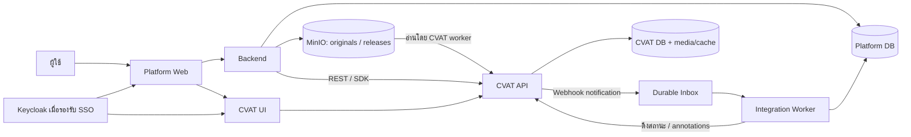

# คู่มือ Backend: MinIO → CVAT → Annotation/QA → Platform Database

← [สารบัญเอกสาร](00_DOCUMENT-INDEX-TH.md)

ปรับปรุง 18 กันยายน 2026 สำหรับคุยและออกแบบร่วมกับ Backend Developer
อ้างอิง source ในเครื่องทดลองสาย CVAT 2.75 และเอกสารทางการ ตัวอย่างเป็นข้อเสนอ implementation ไม่ใช่การยืนยันว่าติดตั้ง MinIO/Keycloak integration แล้ว

## 1. ข้อสรุปที่ต้องเข้าใจตรงกัน

Platform ควบคุมธุรกิจและ dataset version; CVAT จัดการ annotation และ review; MinIO เก็บไฟล์ต้นฉบับ; Backend ประสานผ่าน REST API/SDK และ Webhook

มีฐานข้อมูลสองชุดได้ และมีข้อมูลบางส่วนซ้ำได้โดยตั้งใจ เช่น snapshot ที่อนุมัติแล้ว สิ่งสำคัญคือกำหนดเจ้าของข้อมูลและอายุการเก็บ ไม่ใช่พยายามให้ไม่มีสำเนาเลย

| ข้อความจากบทสนทนาที่ต้องแก้ | ข้อเท็จจริง/แนวทางใช้พัฒนา |
|---|---|
| CVAT DB เก็บแค่ UI, undo หรือคลิกเมาส์ | เก็บ annotations จริง, labels, tasks, jobs, users, issues ฯลฯ ไม่ใช่แค่ข้อมูลชั่วคราว และไม่ควรถือว่าเก็บทุกการคลิก/undo |
| Remote URL ทำให้ไม่มีสำเนาภาพ 100% | remote_files มีขั้นตอนดาวน์โหลดเข้า CVAT; Cloud Storage ก็อาจมี cache/chunks/preview ต้องวัดพื้นที่จริง |
| Webhook ส่งพิกัดทั้งหมดพร้อม image_name | Event เป็นสัญญาณให้ Backend ดึงข้อมูลผ่าน API อย่าสมมติว่ามี annotations ทั้งชุด |
| ทุก update:job แปลว่าเสร็จ | เปลี่ยน assignee หรือ field อื่นก็เกิดได้ ต้องอ่าน stage/state และนโยบาย QA ใหม่ |
| GET annotations ต้องแตก ZIP | Native annotations endpoint คืน JSON; dataset export เป็นอีกกระบวนการ |
| ใช้ task.name เป็นชื่อภาพ | Task มีหลายภาพ ต้องมี frame → image_id mapping |
| Keycloak JWT ใช้แทน CVAT PAT ได้ทันที | Browser SSO กับ API authentication คนละส่วน ต้องมีการรองรับ token ที่ตรวจแล้ว |
| เปิด CVAT_AUTH_OIDC_ENABLED ก็เสร็จ | ไม่พบตัวแปรนี้ใน source ที่ตรวจ ห้ามถือเป็น config ที่รองรับ |
| ลบ Task ได้ทันทีหลัง INSERT | ต้องตรวจความครบถ้วน backup/restore, QA, lineage และ retention ก่อน ไม่มีการลบอัตโนมัติในคู่มือนี้ |

## 2. คำศัพท์

- API: สัญญาการสื่อสาร เช่น GET อ่านข้อมูล, POST สร้าง, PATCH แก้บาง field
- SDK = Software Development Kit: library ช่วยเรียก API และจัดการขั้นตอนหลาย request เช่น upload รอประมวลผล
- CLI: โปรแกรม command line ที่เรียกบริการเดียวกัน syntax ต้องตรงรุ่น ตรวจ `cvat-cli --help` ก่อนใช้คำสั่งเก่าจากบทสนทนา
- Metadata: ข้อมูลประกอบภาพ เช่น image_id, bucket/key, width/height, checksum, camera_id, captured_at ไม่ใช่ทุก field เป็น EXIF หรือฝังในภาพเสมอ
- Annotation: labels, shapes, tags, tracks และ attributes ที่ผู้ใช้สร้าง ภาพไม่ได้ถูกวาดกรอบทับไฟล์ต้นฉบับโดยอัตโนมัติ
- Project รวมงานที่ใช้ labels ร่วมกัน; Task คือชุด media; Job คือหน่วยมอบหมายงานภายใน Task
- Save บันทึก annotation, Resolve ปิด Issue, Acceptance/Completed เป็นสถานะงาน การอนุมัติธุรกิจต้องมีกติกาเพิ่ม

## 3. สถาปัตยกรรมและเจ้าของข้อมูล



| ข้อมูล | เจ้าของหลัก | อีกฝั่งเก็บอะไร |
|---|---|---|
| ภาพต้นฉบับ | MinIO ของ Platform | CVAT มี media ที่นำเข้า/cache ตามวิธีติดตั้ง |
| image identity / camera / dataset version | Platform DB | mapping ไป task/frame |
| annotation ที่ยังแก้ได้ | CVAT | ไม่ต้องคัดลอกทุก Save หากไม่มีความต้องการ |
| Job state, assignee, Issues | CVAT | Platform projection พร้อม synced_at |
| priority / SLA / original annotator / business approval | Platform | ส่งคำสั่งที่จำเป็นผ่าน API |
| approved annotation revision | Release service | JSON artifact หรือ normalized DB ตามการ query |
| training run | Platform | อ้าง immutable release_id |

ไม่จำเป็นต้อง copy annotations ลง SQL ของ Platform ถ้าใช้เพียงส่ง train สามารถเก็บ annotation snapshot ใน MinIO และเก็บ URI/hash ใน DB ได้ ถ้าต้องค้นหาวัตถุหรือแสดงกรอบเองจึงเพิ่ม annotation tables/JSONB

### Temporary output จาก SDK/worker

ไฟล์ `annotations.json`, `labels.json`, `media-meta.json`, `mapped-shapes.json` และ `state.json` เป็นตัวอย่าง artifacts จากการทดลอง ไม่ควรกลายเป็นสำเนาถาวรทุกครั้งที่ sync ในระบบจริง worker ควรอ่านและแปลงข้อมูลเข้า memory หรือพื้นที่ชั่วคราว จากนั้นบันทึก annotation revision ลง Database เดิมด้วย transaction และลบไฟล์ชั่วคราวหลัง commit สำเร็จ

ให้ตรวจ `revision_id`/`source_digest` ก่อน INSERT เพื่อให้การ retry เป็น idempotent ถ้า transaction ล้มเหลวให้เก็บไฟล์หรือสถานะ pending ไว้ retry ห้ามลบข้อมูลใน CVAT หรือภาพต้นฉบับใน MinIO และอย่าลบไฟล์ชั่วคราวก่อนยืนยันว่า database commit สำเร็จ การเก็บ revision ที่อนุมัติแล้วหรือ manifest/hash ถือเป็น audit/lineage ไม่ใช่ data bloat ที่ควรลบทั้งหมด

## 4. Authentication แบบง่ายสำหรับ PoC

1. ผู้ใช้มีบัญชีของตัวเองใน CVAT และอยู่ Organization ที่กำหนด
2. Backend มีบัญชี `backend_service` แยก ใช้ CVAT PAT เก็บฝั่ง server เท่านั้น
3. ให้สิทธิ์ใน Organization เท่าที่จำเป็นในการสร้าง/มอบหมาย/อ่านงาน ทดสอบ permission ไม่จำเป็นต้องเป็น global superuser
4. ผู้ใช้เริ่มด้วย Worker role เดียวได้ แต่ membership และ assignment ยังต้องครบ ผู้จัดงานอาจต้อง role ต่างออกไป
5. ทุกคำสั่งจาก Platform บันทึก platform_actor_id, command_id, target IDs และผลลัพธ์ เพราะ CVAT จะเห็น actor เป็น service account

PAT ไม่ใช่รหัสผ่านและไม่ควรถือเป็นกุญแจถาวร กำหนด expiry/rotation ตามที่รุ่นรองรับ สร้างจากหน้าจอ Access tokens ของบัญชี (ชื่อ/ตำแหน่งเมนูขึ้นกับรุ่น) แล้วเก็บใน secret manager หรือ environment ของ Backend ไม่ส่งให้ browser และไม่ใส่ Git

```bash
export CVAT_BASE_URL='http://localhost:8080'
# กำหนด CVAT_ACCESS_TOKEN ผ่าน secret ของ environment ก่อนรัน
curl --fail-with-body -sS \
  -H "Authorization: Bearer $CVAT_ACCESS_TOKEN" \
  "$CVAT_BASE_URL/api/jobs?org=ptt-demo&page_size=100"
```

อ่าน pagination จน next เป็น null; `org` ใช้ slug เช่น ptt-demo ตรวจ schema หากต้องใช้ org_id ไม่ใส่เลข ID ลง org โดยสมมติเอง

### Keycloak

Platform และ CVAT เป็นคนละ OIDC client ใน realm เดียวกัน เมื่อ Keycloak session ยังใช้ได้อาจ redirect โดยไม่ถาม password ซ้ำ แต่แต่ละแอปมี session ของตัวเอง

เอกสาร SSO ทางการระบุ CVAT Enterprise ต้องตรวจ edition/license ก่อนใช้ config ห้ามสรุปว่า Community เปิด OIDC ได้ด้วย environment สี่ตัวจากบทสนทนา และการมี django-allauth ไม่พิสูจน์ว่าเส้นทางนั้นเปิดใช้งาน

Browser SSO ไม่ได้ทำให้ CVAT REST API รับ Keycloak access token อัตโนมัติ PoC ใช้ CVAT PAT ของ backend_service ต่อไปจนกว่าจะตรวจ token delegation ที่รองรับจริง

OIDC client ที่มี backend เก็บ secret ได้เป็น confidential; SPA ที่ไม่มี backend เก็บ secret ไม่ได้ ใช้ public client + PKCE ตามสถาปัตยกรรม Identity mapping ใช้ issuer + sub; email เป็นข้อมูลประกอบและต้องมีกติกา verified account linking

SSO ไม่ได้ยกเลิก Organization/Job permissions และ reverse proxy ที่ทำ iframe ไม่ใช่ SSO

## 5. Workflow ขาเข้า: MinIO → Task

### 5.1 รับภาพและสร้าง manifest

Backend รับ upload หรือ event จาก MinIO ตรวจไฟล์แล้วบันทึก:

```json
{
  "image_id": "img-101",
  "bucket": "inspection",
  "object_key": "batch-001/img-101.jpg",
  "object_version": "version-if-enabled",
  "sha256": "<content-hash>",
  "width": 1920,
  "height": 1080,
  "camera_id": "cam-1",
  "dataset_version_id": "dataset-v1"
}
```

ไม่ใช้ presigned URL เป็น identity เพราะหมดอายุ เก็บ bucket/key/version หรือใช้ immutable key ไม่ใช้ ETag แทน SHA256 โดยอัตโนมัติ

### 5.2 เลือกวิธีส่งภาพ

| วิธี | เหมาะกับ | สิ่งที่ต้องจัดการ |
|---|---|---|
| remote_files + presigned URLs | PoC / batch เล็ก | CVAT ดาวน์โหลดภาพ, URL ต้องไม่หมดอายุก่อน worker ดึงครบ |
| CVAT Cloud Storage แบบ S3-compatible | ใช้งาน MinIO ต่อเนื่อง | endpoint, TLS, credentials, bucket permission, cache และ task settings |
| local upload | ทดสอบไฟล์บนเครื่อง | ส่ง bytes และอาจมีสำเนาบน CVAT |

CVAT worker ต้องเข้าถึง MinIO ได้ `localhost` ภายใน container หมายถึง container นั้นเอง Presigned URL ต้องใช้ hostname ที่ worker เข้าถึงได้และตรง signature; ห้ามแก้ host หลัง sign ตรวจ network และนโยบายเข้าถึง private address ของ deployment

Cloud Storage ต้องผูกกับ Task data จริง ไม่ใช่สร้าง storage record อย่างเดียว การใช้ server_files, cloud_storage_id, use_cache/copy_data ให้ตรวจ schema/config ของรุ่นนั้น ไม่มีคำรับรอง zero-copy

### 5.3 REST API ที่ใช้

| ขั้น | API | ผล/การติดตาม |
|---|---|---|
| ดู schema | GET /api/schema/?scheme=json | ใช้สัญญาของ instance จริง |
| ดู project | GET /api/projects | ต้อง paginate |
| สร้าง task | POST /api/tasks | ได้ task.id |
| ส่งภาพ | POST /api/tasks/{id}/data | ได้ request ID สำหรับงาน async |
| รอประมวลผล | GET /api/requests/{rq_id} | รอ finished / จัดการ failed ตาม schema |
| ตรวจ media | GET /api/tasks/{id}/data/meta | ตรวจ frames/dimensions/name |
| หา jobs | GET /api/jobs?task_id={id} | เก็บ job IDs และช่วงเฟรม |
| มอบหมาย | PATCH /api/jobs/{id} | assignee เป็น user ID |

ตัวอย่าง Task ใน Project (ใช้ labels ของ Project):

```json
{"name":"Batch_001", "project_id":3, "segment_size":20}
```

ตัวอย่าง data request (URLs สมมติ ต้องแทนด้วย URLs ที่ sign จริง):

```json
{"image_quality":85,"remote_files":["https://minio.example/inspection/batch-001/img-101.jpg?<signed-query>"]}
```

สร้าง command record ก่อนเรียก API บันทึก task_id ทันทีที่สร้างสำเร็จ ถ้า upload ล้มเหลวไม่สร้าง Task ใหม่โดยไม่ตรวจของเดิม เมื่อ timeout ต้อง reconcile ไม่ retry POST อย่างไม่มีเงื่อนไข

### 5.4 Python SDK ที่ตรง signature ที่ตรวจ

SDK major/minor ต้องตรง server ตัวอย่างนี้ตรวจ interface จาก source สาย 2.75; ยังไม่ได้รันกับ MinIO จริง ต้อง pin เวอร์ชันใน environment ของทีม

```python
import json
import os
from cvat_sdk import make_client, models
from cvat_sdk.core.proxies.tasks import ResourceType

# JSON array ของ presigned URLs ในไฟล์ private; ไม่ commit หรือ log URLs
with open(os.environ["MINIO_URLS_FILE"], encoding="utf-8") as f:
    image_urls = json.load(f)

with make_client(
    os.environ["CVAT_BASE_URL"],
    access_token=os.environ["CVAT_ACCESS_TOKEN"],
) as client:
    client.organization_slug = os.environ.get("CVAT_ORG", "ptt-demo")
    task = client.tasks.create_from_data(
        spec=models.TaskWriteRequest(
            name="Batch_Cam1_2026-09-18",
            project_id=int(os.environ["CVAT_PROJECT_ID"]),
            segment_size=20,
        ),
        resources=image_urls,
        resource_type=ResourceType.REMOTE,
        data_params={"image_quality": 85},
    )
    print("Task ID:", task.id)
```

create_from_data ช่วยรอ processing แต่ production ควรแยก create และ upload_data เพื่อ persist task.id ก่อน upload:

```python
# ภายใน with make_client และหลังสร้าง task:
task.upload_data(
    resources=image_urls,
    resource_type=ResourceType.REMOTE,
    params={"image_quality": 85},
    wait_for_completion=True,
)
```

อย่าใช้ TaskSpec import หรือ upload_data(remote_files=..., image_quality=...) จากบทสนทนาเดิม เพราะไม่ตรง signature ที่ตรวจ

## 6. Annotate → QA → Approved

```text
สร้าง Task และ mapping สำเร็จ
→ มอบหมาย annotator / annotation / in progress
→ annotator Save
→ coordinator ส่ง reviewer / validation / in progress
→ reviewer เปิด Issue → ส่งกลับ annotator → Save → reviewer ตรวจซ้ำ/Resolve
→ acceptance / completed + business approval
→ capture annotation revision → validate → publish release
```

PATCH ตัวอย่าง (17 เป็น user ID สมมติ):

```json
{"assignee":17,"stage":"validation","state":"in progress"}
```

สถานะ completed อย่างเดียวไม่พอ เพราะต้องดู stage และ policy การตรวจ ไม่มี open Issue ไม่ได้แปลว่าตรวจครบทุกภาพ หากหนึ่ง Task มีหลาย Jobs ต้องกำหนดว่าจะ publish ทั้ง Task เมื่อผ่านครบ หรือเลือกเฉพาะ Jobs ที่ผ่าน และจัดการ overlap/GT/consensus ไม่ให้นับซ้ำ

## 7. Webhook ที่ถูกต้อง

ตรวจรายการ events ของ instance ที่ GET /api/webhooks/events ตั้ง scope Project/Organization และ target เช่น https://platform.example/integrations/cvat/webhooks พร้อม secret

CVAT ไม่ได้มีเมนู global Webhooks ตำแหน่งเดียวทุกรุ่น ใช้ UI ของ scope ที่ต้องการหรือ POST /api/webhooks ตาม schema จริง

```text
receive raw bytes
→ verify X-Signature-256 (HMAC-SHA256)
→ durable inbox commit
→ acknowledge
→ worker fetch current Job
→ check approval policy
→ fetch annotations + labels + frame metadata
→ validate / map / persist revision atomically
```

ตัวอย่าง FastAPI **เฉพาะการตรวจ signature** ไม่ใช่ listener สำเร็จรูป; ต้อง implement inbox ที่ persist จริงก่อนตอบสำเร็จ:

```python
import hashlib
import hmac
import json
import os
from fastapi import HTTPException, Request

async def verified_payload(request: Request):
    raw = await request.body()  # ตั้ง body limit ที่ proxy/application
    expected = "sha256=" + hmac.new(
        os.environ["CVAT_WEBHOOK_SECRET"].encode(), raw, hashlib.sha256
    ).hexdigest()
    received = request.headers.get("X-Signature-256", "")
    if not hmac.compare_digest(received, expected):
        raise HTTPException(401, "Invalid signature")
    try:
        return json.loads(raw)
    except (ValueError, UnicodeDecodeError):
        raise HTTPException(400, "Invalid JSON")
```

อย่าใช้ `if completed or event == update:job` เพราะจะประมวลผลงานที่ยังไม่ผ่านตรวจ อย่า INSERT จาก payload ที่สมมติว่ามี annotations หรือใช้ชื่อ Task แทนชื่อภาพ

Receiver ต้อง validate event/resource/scope; worker ตรวจ current state อีกครั้ง รองรับ event ซ้ำ มาช้า สลับลำดับ ใช้ delivery identity ที่ตรวจจากรุ่นจริงหรือ digest ร่วมกับ idempotent processing ไม่ทิ้งเหตุการณ์เพราะ payload เหมือนกันอย่างเดียว

Webhook เป็น near-real-time ไม่รับประกันทันที ใช้ periodic reconciliation ร่วมด้วย ถ้า inbox DB ล่มต้องตอบผิดพลาดให้ retry ไม่ตอบ success ทั้งที่ข้อมูลยังไม่ได้เก็บ

## 8. ดึงผลลัพธ์จริงและจับคู่ภาพ

```text
GET /api/jobs/{id}
GET /api/jobs/{id}/annotations
GET /api/tasks/{task_id}/data/meta
GET /api/labels?task_id={task_id}   (paginate)
```

GET /api/tasks/{id}/annotations ใช้ได้เมื่อต้องการขอบเขตทั้ง Task ตาม policy JSON native แบบย่อมีหน้าตาดังนี้ (IDs สมมติ ไม่ใช่ response ที่จับจากระบบ):

```json
{
  "version": 1,
  "tags": [],
  "shapes": [
    {"id": 501, "frame": 0, "label_id": 7, "type": "rectangle",
     "points": [150.5, 300.0, 450.2, 600.8], "rotation": 0,
     "occluded": false, "outside": false, "attributes": []}
  ],
  "tracks": []
}
```

JSON นี้ไม่ได้มี image_id ของ Platform หรือ label name ทุก shape ต้อง join:

```text
(instance_id, task_id, frame) → task_frames → image_id → MinIO bucket/key/version
label_id → labels API snapshot → class_name + class_schema_version
```

สร้าง frame mapping หลัง Task processing สำเร็จ ตรวจ sorting, start_frame, frame_step, filename และ checksum อย่าสมมติ index ใน array เท่ากับ frame เสมอ งานวิดีโอ/GT มีเงื่อนไขเพิ่ม ตัวอย่างเริ่มต้นจำกัดภาพนิ่งเรียงต่อเนื่อง ไม่มี frame filter

rectangle rotation=0: points คือ xmin,ymin,xmax,ymax หน่วยพิกเซล; COCO bbox เป็น x,y,width,height; YOLO bbox เป็น center_x,center_y,width,height หารด้วยขนาดภาพ การแปลงต้องใช้ขนาดภาพจริง

สำหรับ rotated rectangle, polygon, mask, skeleton, track อย่าอ่านแค่ points สี่ตัว ต้องรองรับ representation หรือ reject อย่างชัดเจน Tags เป็น label ระดับภาพ ไม่มี bbox; Tracks มีหลาย keyframes และอาจต้อง interpolation

ภาพไม่มีวัตถุยังต้องมี revision/membership ว่าตรวจแล้วจำนวน annotation เป็นศูนย์ แยกจากภาพที่ไม่เคยตรวจ

## 9. Schema ฝั่ง Platform

ข้อเสนอ PostgreSQL ขั้นต้นสำหรับภาพนิ่ง ต้องเพิ่ม tenancy/authorization ตามระบบจริง:

```sql
CREATE TABLE images (
  id uuid PRIMARY KEY,
  bucket text NOT NULL,
  object_key text NOT NULL,
  object_version text NOT NULL DEFAULT '',
  sha256 text NOT NULL,
  width integer NOT NULL CHECK (width > 0),
  height integer NOT NULL CHECK (height > 0),
  metadata jsonb NOT NULL DEFAULT '{}',
  UNIQUE (bucket, object_key, object_version)
);
CREATE TABLE task_frames (
  instance_id text NOT NULL,
  task_id bigint NOT NULL,
  frame integer NOT NULL,
  image_id uuid NOT NULL REFERENCES images(id),
  PRIMARY KEY (instance_id, task_id, frame)
);
CREATE TABLE annotation_revisions (
  id uuid PRIMARY KEY,
  instance_id text NOT NULL,
  task_id bigint NOT NULL,
  source_scope jsonb NOT NULL,
  source_digest text NOT NULL,
  manifest_uri text NOT NULL,
  approval jsonb NOT NULL,
  captured_at timestamptz NOT NULL DEFAULT now(),
  UNIQUE (instance_id, task_id, source_digest)
);
CREATE TABLE revision_images (
  revision_id uuid REFERENCES annotation_revisions(id),
  image_id uuid REFERENCES images(id),
  annotation_count integer NOT NULL CHECK (annotation_count >= 0),
  PRIMARY KEY (revision_id, image_id)
);
CREATE TABLE annotations (
  revision_id uuid NOT NULL,
  image_id uuid NOT NULL,
  annotation_key text NOT NULL,
  label_id bigint NOT NULL,
  label_name text NOT NULL,
  geometry jsonb NOT NULL,
  attributes jsonb NOT NULL DEFAULT '[]',
  PRIMARY KEY (revision_id, image_id, annotation_key),
  FOREIGN KEY (revision_id, image_id)
    REFERENCES revision_images(revision_id, image_id)
);
```

annotation_key ต้องรวมชนิด resource และขอบเขต เช่น job:2:shape:501 เพราะ IDs อาจซ้ำระหว่าง tags/shapes/tracks Source digest คำนวณจาก canonical annotations + label schema + frame manifest + scope ไม่ใช้ Job ID อย่างเดียว

เพิ่มตาราง production: commands_outbox, webhook_inbox, assignments/history, review_rounds, dataset_releases และ training_runs ตามความต้องการ ข้อมูล processed_at คือเวลาที่ระบบประมวลผล ไม่ใช่เวลาที่มนุษย์วาดจริง

### บันทึกโดยไม่ทำให้ข้อมูลซ้ำ/ค้าง

1. Worker ล็อกงาน sync ต่อ scope แล้วอ่านสถานะและข้อมูลที่อนุมัติ
2. ตรวจ frame/label mapping, geometry, count และภาพว่าง
3. สร้าง snapshot immutable พร้อม digest; ถ้า digest เดิมผ่านแล้วให้ no-op
4. ใน transaction เดียว สร้าง revision, revision_images และ annotations แล้วเปลี่ยน current revision pointer ของ scope
5. ไม่ INSERT เพิ่มอย่างเดียวเมื่อดึงซ้ำ มิฉะนั้น shape ที่ลบใน CVAT จะยังค้างอยู่ใน Platform
6. ถ้าการอ่านหลาย API เจอการแก้ระหว่างทาง ให้ยกเลิก publish และ retry; updated_date/version เป็นตัวช่วย ไม่ใช่ atomic snapshot ทั้งระบบ ต้อง freeze งานหรือมี release protocol
7. Commit สำเร็จจึง mark inbox processed ถ้าล้มเหลว rollback และ retry

ถ้าเลือกเก็บ snapshot ใน MinIO แทนตาราง annotations ให้เก็บ manifest/revision pointer ใน DB เช่นเดิม แก้กรณี upload artifact สำเร็จแต่ transaction ล้มเหลวด้วย orphan cleanup ตามนโยบาย

## 10. คุมพื้นที่และเก็บย้อนหลัง

- เก็บต้นฉบับแบบ immutable ใน MinIO และอ้างอิงด้วย key/version/hash
- CVAT cache/chunks/media เป็นพื้นที่ที่ต้อง budget และ monitor แยก ไม่มีข้อรับรองว่าภาพไม่ซ้ำ
- ไม่ export ZIP เพื่อ polling status; ใช้ API/Webhook
- Snapshot เฉพาะ revision/release ที่ต้องใช้; training หลาย run อ้าง release เดิม ไม่สร้างสำเนาใหม่ทุก run
- Training อ่าน originals + annotation manifest ได้ หรือสร้าง COCO/YOLO package เมื่อเครื่องมือฝึกต้องการ ไม่จำเป็นต้อง ZIP เสมอ
- แยก annotation snapshot, dataset export และ task backup: dataset export อาจไม่รักษา workflow/Issues/Comments ครบ
- ลบ Task ผ่าน API เฉพาะหลังผ่าน retention/approval/backup restore check และไม่มีงานแก้ค้าง การลบอาจทำให้กลับไปแก้งานเดิมไม่ได้
- PostgreSQL DELETE ไม่รับประกันคืนพื้นที่ไฟล์ให้ OS ทันที รวมถึง backup, indexes, cache และ object versions ยังใช้พื้นที่

## 11. เกณฑ์ทดสอบก่อนส่งมอบ

| กรณี | ผลที่ต้องได้ |
|---|---|
| 20 ภาพจาก MinIO | Task สำเร็จ mapping ครบและชื่อซ้ำไม่ชน |
| URL หมดอายุ/worker เข้า MinIO ไม่ได้ | สถานะล้มเหลวชัดเจน retry ไม่สร้าง Task ซ้ำ |
| Save annotation | ยังไม่ถือว่า approved |
| update:job เปลี่ยน assignee | ไม่ publish release โดยอัตโนมัติ |
| open Issues | ไม่ผ่าน policy ตรวจรับ |
| webhook ปลอม/ซ้ำ/สลับลำดับ | ปฏิเสธ signature ผิดและไม่มีข้อมูลซ้ำ |
| วัตถุถูกลบ/ภาพไม่มีวัตถุ | snapshot ใหม่สะท้อนการลบและภาพว่างครบ |
| Worker ล่มก่อน commit | retry ได้ ไม่ประกาศ success ลวง |
| labels เปลี่ยน/งานแก้ระหว่าง capture | ไม่ publish snapshot ที่ mapping ไม่ตรง |
| ลงชื่อผ่าน Keycloak | ตรวจได้ทั้ง session, membership และ Job permissions |

## 12. สถานะของระบบทดลองเรา

มี CVAT Project ptt2 (#3), Task train (#2), Job #2 และ workflow ที่ทดสอบ 20 ภาพก่อนหน้านี้ มี local Platform proxy ที่ http://localhost:5175/platform/ อ่าน API และส่งคำสั่ง workflow ผ่าน CVAT session ได้

ยังไม่ได้ติดตั้งวงจร MinIO → durable webhook inbox → Platform DB → immutable release และยังไม่ได้ติดตั้ง Keycloak SSO เอกสารนี้คือแนวทางสำหรับทำส่วนเหล่านั้น ไม่ควรแจ้งว่าโค้ด listener ที่เพียง print เป็นระบบบันทึกข้อมูลสำเร็จแล้ว

## 13. แหล่งตรวจสอบและเอกสารประกอบ

- [CVAT API Docs แบบ interactive](https://app.cvat.ai/api/docs/)
- [CVAT API/SDK และ version compatibility](https://docs.cvat.ai/docs/api_sdk/)
- [Task SDK recipes](https://docs.cvat.ai/docs/api_sdk/sdk/examples/tasks/)
- [SSO configuration — Enterprise](https://docs.cvat.ai/docs/account_management/sso/)
- [API status guide](11_CVAT-JOB-STATUS-API-GUIDE-TH.md)
- [Database monitoring](12_CVAT-DATABASE-SCHEMA-MONITORING-GUIDE-TH.md)
- [Platform architecture](01_AI-PLATFORM-CVAT-INTEGRATION-ARCHITECTURE-TH.md)
- [Prototype ที่ใช้งานในเครื่อง](../prototype/README.md)

ตรวจ implementation จาก source ใน workspace: cvat-sdk/cvat_sdk/core/proxies/tasks.py (upload_data/create_from_data), cvat-sdk/cvat_sdk/core/client.py (make_client), cvat/apps/engine/task.py (remote_files → _download_data), cvat/apps/webhooks/utils.py (X-Signature-256) เมื่อ upgrade ให้ตรวจใหม่และยึด OpenAPI ของ instance เป็นหลัก
