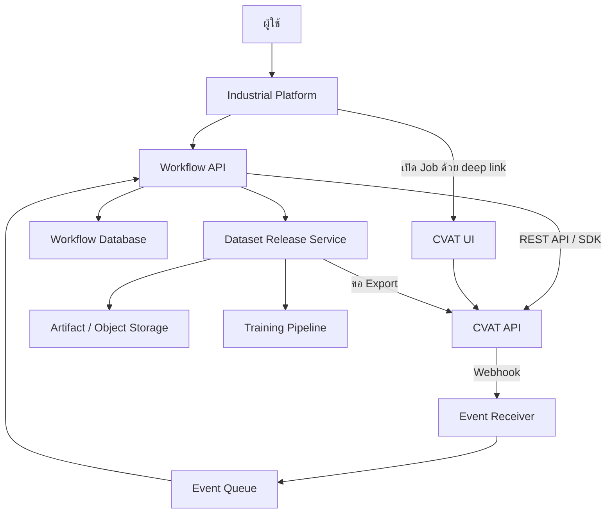

# แนวทางเชื่อม CVAT เข้ากับแพลตฟอร์มอุตสาหกรรม

← [สารบัญเอกสาร](00_DOCUMENT-INDEX-TH.md)

จัดทำ: 17 กันยายน 2026
สำหรับ: Developer, Solution Architect และผู้ดูแลระบบ

API reference ของ instance: [CVAT API Docs](https://app.cvat.ai/api/docs/) หรือ `http://localhost:8080/api/docs/` สำหรับ CVAT local; ให้ยึด schema ของ instance จริงเมื่อมีความแตกต่างจาก public reference

เอกสารผลิตภัณฑ์และการติดตั้ง: [CVAT Documentation](https://docs.cvat.ai/docs/)

เอกสารนี้บันทึกแนวทาง integration ที่อภิปรายจากการทดลอง CVAT ของทีม เป็นข้อเสนอเชิงสถาปัตยกรรม ไม่ใช่ผลสำรวจว่าส่วนใหญ่ของบริษัทใช้รูปแบบใด และไม่ใช่การยืนยันว่าระบบ integration ถูกพัฒนาแล้ว

> ขอบเขตฉบับนี้คือ integration contract: consistency, retry, outbox/inbox และ release approval ส่วนตัวอย่าง API/SDK/MinIO ให้ดู [คู่มือ Backend](03_CVAT-MINIO-BACKEND-END-TO-END-TH.md) ส่วนการรัน iframe ที่มีอยู่แล้วดู [Prototype](../prototype/README.md)

## 1. ข้อเสนอสำหรับโครงการนี้

แยก CVAT เป็นบริการสำหรับ annotation และ review แล้วเชื่อมกับแพลตฟอร์มหลักผ่าน API/SDK และ Webhook ผู้ใช้เปิดหน้าแก้ภาพผ่าน deep link ส่วนคิวงาน กำหนดส่ง และ dataset release อยู่ในแพลตฟอร์ม

อย่าใช้การ export dataset เป็นวิธี polling หรือ sync สถานะ เพราะจะสร้างไฟล์ซ้ำและทำให้ข้อมูลใน Platform ล่าช้า การ export ใช้เป็น immutable release artifact สำหรับ training, backup หรือการส่งมอบเท่านั้น

การแยกบริการไม่ได้หมายถึงต้องซื้อเครื่องแยกทุกส่วน ระยะแรกอาจอยู่บน host เดียวกัน แต่ควรแยกขอบเขตข้อมูล การ deploy และสิทธิ์เข้าถึงไว้

CVAT มี REST API, Python SDK และ CLI สำหรับ integration ตาม [เอกสาร Developer](https://docs.cvat.ai/docs/api_sdk/) และ [SDK](https://docs.cvat.ai/docs/api_sdk/sdk/)

## 2. เปรียบเทียบทางเลือก

| รูปแบบ | เหมาะกับ | สิ่งที่ต้องดูแล |
|---|---|---|
| ใช้ CVAT แยกและส่ง ZIP ด้วยมือ | ทดลองหรือทีมเล็ก | การติดตามและ versioning ด้วยมือ |
| เปิด CVAT ด้วย deep link + อ่าน API | เริ่มสร้างแพลตฟอร์ม | User mapping, permission และ sync |
| API + Webhook + Workflow Service | หลายทีม มีคิวและ QA | Event processing, consistency, release |
| ฝังผ่าน iframe | มีข้อกำหนด UX เฉพาะ | CSP, frame headers, cookies, login |
| แก้ frontend หรือ fork CVAT | UI มาตรฐานไม่ตอบโจทย์จริง | Merge upstream, regression และค่า maintenance |

สำหรับระบบ PTT ตัวอย่าง แนะนำเริ่ม deep link + API แล้วเพิ่ม workflow automation เมื่อกติกาทีมชัด ไม่จำเป็นต้องสร้างเครื่องมือวาดกรอบใหม่

## 3. ภาพรวมสถาปัตยกรรม



CVAT มีฐานข้อมูลและ storage ภายในตาม deployment ของตนเอง ส่วน object storage สำหรับภาพต้นฉบับและ release ต้องกำหนดการเชื่อมต่อให้ชัด ไม่ควรสมมติว่า CVAT จะใช้ bucket ของแพลตฟอร์มโดยอัตโนมัติ

## 4. แบ่งเจ้าของข้อมูล

| ข้อมูล | แหล่งหลัก | การใช้งานอีกฝั่ง |
|---|---|---|
| ภาพใน Task และ annotations | CVAT | Platform เก็บ reference และ summary |
| Job Assignee / Stage / State | CVAT | Platform อ่านยืนยันและเก็บสถานะที่ sync แล้ว |
| Issue / Comment | CVAT | Platform รวมรายงานหรือเก็บ snapshot สำหรับ audit |
| Work order, plant, area, equipment | Platform | ผูกกับ CVAT IDs |
| Priority, due date, SLA | Workflow Service | ใช้เลือกและจัดลำดับงาน |
| คนทำเดิมและประวัติส่งงาน | Workflow Service | ใช้ส่งคืนและตรวจย้อนหลัง |
| Business approval | Workflow Service | เก็บผู้อนุมัติและ revision ที่อนุมัติ |
| Dataset release และ checksum | Release Service | เชื่อม artifacts กับ source Jobs |
| Model metrics และ training run | ML Platform | อ้าง release ที่ใช้ฝึก |

หากแพลตฟอร์มควบคุม Assignee ให้ถือการเปลี่ยนใน CVAT เป็นคำสั่งที่ต้องยืนยันผล ไม่ใช้ local DB และ CVAT เป็นผู้เขียนอิสระสองฝั่งโดยไม่มีกติกา

## 5. Resource mapping และตัวอย่างจริง

ตัวอย่างที่ทดสอบเมื่อ 16 กันยายน 2026:

| รายการ | ค่า |
|---|---|
| Organization | ptt-demo |
| Project | ptt2, ID 3 |
| Task | train, ID 2 |
| Job | ID 2, 20 ภาพ |
| ผล QA | Acceptance / Completed, Issue 1 จุด resolved |
| Export | 241 annotations, 26 class definitions |

ข้อมูลนี้เป็น snapshot ของการทดลอง ไม่ใช่สถานะสดตลอดเวลา

```json
{
  "work_item_id": "WI-2026-00123",
  "cvat_instance_id": "cvat-internal-01",
  "organization_slug": "ptt-demo",
  "cvat_project_id": 3,
  "cvat_task_id": 2,
  "cvat_job_id": 2,
  "original_annotator_id": "annotator01",
  "reviewer_id": "reviewer01",
  "business_status": "accepted"
}
```

JSON เป็น schema ของระบบเสริม ไม่ใช่ API response ของ CVAT ใช้ instance + resource ID เป็น reference เพราะ ID อาจซ้ำข้าม CVAT instances และชื่อ Project/Task เปลี่ยนได้

## 6. ประสบการณ์ผู้ใช้

1. ผู้ใช้เปิด Platform แล้วเห็น My Work หรือ QA Queue
2. กด Open Annotation Job
3. เปิด CVAT ที่ URL เช่น `https://cvat.example.com/tasks/2/jobs/2`
4. ทำ annotation และ Save ใน CVAT
5. ส่งตรวจผ่าน action ที่ทีมกำหนด
6. Reviewer เปิด Job และตรวจ/Comment ใน CVAT
7. Platform แสดงความคืบหน้าและผลตรวจที่ sync แล้ว

การ Save ไม่เท่ากับ Submit for QA หากใช้ปุ่มส่งตรวจใน Platform ต้องมีวิธียืนยันว่าไม่มีงานค้างที่ยังไม่ Save ใน browser API ฝั่ง server ไม่สามารถรับรองการแก้ที่ยังอยู่ใน browser อีกแท็บได้เพียงจากสถานะ Job

ทดสอบสิทธิ์ที่ระดับ Job ด้วย การเข้า Task page ไม่ได้สำเร็จเสมอสำหรับ Worker ที่ได้รับเฉพาะ Job ในการทดลอง annotator01 เปิด Job ได้แต่หน้า Task ตอบ 403

## 7. Workflow และสถานะ

```text
Unassigned → Annotating → Ready for QA → Reviewing
                 ↑                         │
                 └── Changes requested ────┤
                                           └── Accepted
```

| Business state | Mapping ที่เสนอ |
|---|---|
| Annotating | Annotation / In progress |
| Ready for QA | คิวใน Platform ก่อนหรือระหว่างจัด reviewer |
| Reviewing | Validation / In progress |
| Changes requested | บันทึกเหตุผลและส่งคืนคนทำเดิม |
| Accepted | Acceptance / Completed หลังผ่านนโยบาย |

Resolve ปิด Issue แต่ไม่ใช่ approval ทั้ง Job และจำนวน open issues เป็นศูนย์ไม่ได้พิสูจน์ว่าตรวจครบทุกภาพ ต้องเก็บ reviewer decision และขอบเขตที่ตรวจ

Worker reviewer ไม่จำเป็นต้องได้สิทธิ์ Supervisor เพื่อทำ review ถ้าไม่ต้องจัดการงานอื่น ส่วน Coordinator ต้อง map สิทธิ์ตามการทำงานจริงและทดสอบกับรุ่นที่ติดตั้ง

## 8. ใช้ API และ SDK อย่างไร

API ใช้ส่งคำสั่งและอ่านสถานะจริง เช่น สร้าง Task, ส่งข้อมูล, อ่าน Jobs, เปลี่ยน Assignee, อ่าน annotations และเริ่ม export

SDK ช่วยจัดการหลาย request ที่เป็นงานเดียวกัน เช่น upload หรือ export ควร pin เวอร์ชันให้เข้ากับ server ตาม [ข้อกำหนด compatibility ของ CVAT](https://docs.cvat.ai/docs/api_sdk/)

Integration client ต้องรองรับ:

- Pagination ทุก list endpoint
- Timeout และ retry แบบมีขอบเขต
- Authentication และ Organization context
- 401/403 พร้อมแยกปัญหาตัวตนกับสิทธิ์
- 429 และ server errors
- Async request ID และการติดตาม Requests
- Correlation ID ใน log ฝั่ง Platform
- Read-after-write เพื่อยืนยันผล

ไม่สมมติว่า CVAT รองรับ idempotency header ทุก write endpoint ให้ระบบเสริมเก็บ command ID, external mapping และตรวจผลก่อน retry โดยเฉพาะการสร้าง resource

งาน annotation ปกติให้ Task creation และ segment configuration เป็นตัวกำหนด Jobs ตามที่ API รุ่นนั้นรองรับ อย่าสมมติว่าสร้างหรือแบ่ง annotation Job เดิมผ่าน endpoint ทั่วไปได้เสมอ

## 9. Webhook: รับเหตุการณ์และตรวจสอบซ้ำ

CVAT รองรับ Webhook ระดับ Project/Organization สำหรับติดตามการเปลี่ยน resource รายการ event จริงควรอ่านจาก `/api/webhooks/events` ของ instance และตรวจเอกสาร [Webhooks](https://docs.cvat.ai/docs/administration/community/advanced/webhooks/)

ตัวอย่างปลายทางของ Platform:

```text
POST /integrations/cvat/webhooks
```

แนวทาง receiver:

1. ตรวจ signature จาก raw request body ก่อนเชื่อถือ payload
2. บันทึก event เข้า durable inbox
3. ตอบกลับเมื่อเก็บสำเร็จ
4. Worker อ่าน inbox แล้วดึง resource ล่าสุดจาก CVAT
5. อัปเดต projection ของ Platform และ audit
6. Retry เมื่อผิดพลาด โดยไม่สร้างผลข้างเคียงซ้ำ

เมื่อกำหนด secret CVAT ใช้ header `X-Signature-256` รูปแบบ HMAC-SHA256 ตาม [Webhook recipes](https://docs.cvat.ai/docs/api_sdk/sdk/examples/webhooks/) ควรเปรียบเทียบ signature แบบ constant-time และตรวจรูปแบบจาก deployment จริง

อย่าสมมติว่ามี `delivery_id` ใน JSON เสมอ ตรวจ headers/payload ของรุ่นจริงก่อนเลือก deduplication key หากไม่มี ID ที่เชื่อถือได้ ให้เก็บ digest และออกแบบการประมวลผลให้เรียกซ้ำแล้วผลไม่ซ้ำ โดยไม่ทิ้งเหตุการณ์จริงสองรายการที่บังเอิญเหมือนกัน

Webhook เป็นตัวกระตุ้นให้ตรวจสถานะ ไม่ใช่หลักฐานว่าข้อมูลยังคงสถานะนั้นตลอดไป เหตุการณ์อาจซ้ำ มาช้า หรือข้ามลำดับได้

## 10. Polling และ reconciliation

ใช้ Webhook ร่วมกับ periodic reconciliation:

```text
Command: Platform → CVAT API
Event: CVAT → Webhook inbox
Reconcile: Platform อ่าน CVAT เป็นระยะเพื่อแก้ความคลาดเคลื่อน
```

หาก API รุ่นนั้นมี filter ตามวันที่ให้ใช้ตาม schema จริง หากไม่มี ให้ paginate ทรัพยากรในขอบเขตที่เกี่ยวข้อง แล้วเทียบ version/timestamp/state ไม่สมมติว่าทุก endpoint มี cursor หรือ updated-since filter

CVAT มี API สำหรับตรวจ webhook deliveries และ redelivery ตาม [Webhooks API](https://docs.cvat.ai/docs/api_sdk/sdk/reference/apis/webhooks-api/) แต่ยังต้องออกแบบ monitoring และการ retry ของ consumer เอง

## 11. การจัดคิวและความสอดคล้องระหว่างสองระบบ

เลือกงานโดยกรองสิทธิ์ ทักษะ และจำนวนงานค้าง จากนั้นเรียง priority, due date และเวลารอ

การ claim local DB ต้อง atomic แต่ local transaction ไม่สามารถครอบ CVAT API ให้เป็น transaction เดียวกันได้ จึงแนะนำ:

```text
claim_pending → ส่งคำสั่ง CVAT → อ่านยืนยัน → assigned
                     │
                     └→ sync_failed / retry / coordinator intervention
```

เก็บ command record ก่อนเรียก API ใช้ expected version ป้องกัน local concurrent write และตรวจ current owner ใน CVAT ก่อนเปลี่ยน หาก API ไม่มี compare-and-swap ต้องมีการ serialize คำสั่งต่อ Job และตรวจ conflict จากการแก้ตรงใน UI

ห้ามแสดงว่างานถูกมอบหมายแล้วถ้า CVAT ยังไม่ยืนยันสำเร็จ

## 12. Schema ที่ควรมี

| Entity | Field สำคัญ |
|---|---|
| WorkItem | instance ID, Job ID, original annotator, current owner, business state, due date |
| AssignmentHistory | from/to, actor, reason, timestamp |
| WorkflowEvent | event key, source, before/after, actor, timestamp |
| Command / Outbox | command ID, target Job, payload, pending/success/failed, retry count |
| WebhookInbox | receive time, digest/verified source ID, raw payload reference, processing state |
| ReviewRound | reviewer, source revision, decision, open issues at approval |
| DatasetRelease | source Jobs, label mapping, split manifest, artifact URI, hash, approval reference |
| TrainingRun | release ID, code revision, model config, metrics, output artifact |

ใช้ UTC สำหรับเวลาภายในและแปลง timezone ที่ UI แยก `captured_at` เวลาอ่าน snapshot ออกจาก `occurred_at` เวลาเหตุการณ์จริง

## 13. SSO และการจัดการผู้ใช้

Deep link ไม่ได้ทำให้ login ร่วมกันเอง ต้องจัดการ identity/session ด้วยกลไกที่ CVAT edition และ deployment รองรับ

เอกสาร [Enterprise deployment](https://docs.cvat.ai/docs/administration/enterprise/kubernetes/) อธิบาย SSO configuration แต่ไม่ควรนำไปสรุปว่าความสามารถทุกอย่างใช้ได้กับ Community deployment ปัจจุบัน ต้องตรวจ edition, license และ protocol ที่รองรับก่อนออกแบบกับ Keycloak หรือ Microsoft Entra ID

ต้องกำหนด:

- Platform user ID ผูกกับ CVAT user ID อย่างไร
- ใคร provision และ deactivate บัญชี
- ใครจัดการ Organization membership
- Role เปลี่ยนแล้ว sync อย่างไร
- Logout และ session expiry ทำงานอย่างไร
- Service account ใช้สิทธิ์ใดและ audit แยกจากผู้ใช้จริงอย่างไร

ไม่ให้ browser ถือ shared admin token API ฝั่ง Platform ต้องตรวจสิทธิ์ผู้ใช้เองก่อนเรียกด้วย service identity

## 14. Storage และเส้นทางข้อมูล

แยกข้อมูลอย่างน้อยเป็น:

```text
raw/          ภาพต้นฉบับ
staging/      archive และข้อมูลระหว่าง import/export
releases/     dataset ที่ตรวจแล้ว พร้อม manifest
models/       training outputs
reports/      snapshots และ validation results
```

ถ้าเชื่อม cloud storage ของ CVAT ให้ตรวจ provider, credentials, network reachability และ source/target storage settings จริง ข้อมูลอาจถูก cache หรือ copy ตาม workflow จึงต้องประมาณพื้นที่จากพฤติกรรมที่วัดได้

CVAT database และ Workflow database แยกกัน การ query ฐาน CVAT เพื่อ debug ในเครื่องทดลองไม่ควรถูกนำไปเป็น integration contract สำหรับ production

## 15. Export → Quality gate → Dataset release

ขั้นตอนเสนอ:

1. เลือกขอบเขต Jobs ที่ผ่าน QA
2. เก็บ approval และ revision/snapshot ที่อ้างอิง
3. ควบคุมการแก้ข้อมูลระหว่าง export หรือพิสูจน์ว่า revision ไม่เปลี่ยน
4. เริ่ม export และติดตาม async request
5. ตรวจ archive และ parser
6. เทียบภาพ, class mapping และ annotations ตาม export format
7. คำนวณ SHA256 ของ artifact
8. เก็บ immutable release manifest
9. อนุญาต training ให้ใช้ release นี้

การ export ทั้ง Project ไม่ได้เป็นการกรองเฉพาะ Jobs ที่ accepted ให้อัตโนมัติ ต้องเลือกขอบเขตหรือเตรียม release dataset ให้ตรงนโยบาย

กฎตรวจต้องเหมาะกับ format เช่น Detection ตรวจ bounding boxes แต่ Segmentation ตรวจ polygons/masks ไม่ใช้จำนวน live shapes เทียบทุก format โดยไม่คำนึงถึงการแปลงหรือ track interpolation

ตัวอย่าง manifest ของระบบที่เสนอ:

```json
{
  "release_id": "ptt-equipment-v1",
  "source": {"cvat_instance_id": "cvat-internal-01", "job_ids": [2]},
  "format": "Ultralytics YOLO Detection 1.0",
  "images": 20,
  "annotations": 241,
  "class_definitions": 26,
  "artifact_uri": "s3://datasets/releases/ptt-equipment-v1.zip",
  "sha256": "<actual artifact hash>",
  "validation_status": "passed",
  "approval_reference": "<review record ID>"
}
```

การมี 26 class definitions ไม่ได้แปลว่าชุดภาพเล็กมีตัวอย่างครบ 26 classes และ zero mismatches ยืนยันความตรงกันของข้อมูลที่เปรียบเทียบ ไม่ได้รับรองความถูกต้องเชิงเนื้อหาของทุก annotation

## 16. Training และ active learning

TrainingRun ต้องอ้าง release ID และ hash พร้อม code revision, dependencies, seed, model configuration และ metrics ที่เกี่ยวข้อง

ชุดทดลอง 20 ภาพมีเฉพาะ train เหมาะทดสอบระบบ ยังต้องจัด validation/test ที่เหมาะสมก่อนประเมินโมเดลจริง

```text
Release → Train → Evaluate → ทดลองใช้งาน
                              ↓
                เก็บภาพทายผิดหรือไม่แน่ใจ
                              ↓
                   ส่งเข้า CVAT รอบใหม่
```

การเลือกภาพ confidence ต่ำเป็นเพียงวิธีหนึ่ง ไม่ใช่ตัวแทนของข้อผิดพลาดทั้งหมด ต้องกำหนดเกณฑ์ sampling และตรวจความหลากหลายของภาพด้วย

## 17. Reporting และข้อจำกัดของรายงานปัจจุบัน

CSV ปัจจุบันเป็น snapshots ส่วน JSON validation เป็นหลักฐานการตรวจ export รอบหนึ่ง ใช้ทำ dashboard สถานะและ release checks ได้ แต่ยังไม่ใช่ event history ครบวงจร

ไม่สามารถใช้สอง snapshots คำนวณ active working time, SLA จริง หรือสรุปว่าไม่มีการเปลี่ยนสถานะระหว่างนั้น ต้องเพิ่ม workflow events และระบุวิธีวัดเวลาชัดเจน

ตัวอย่างหน้าจอ:

- My Work: งานของผู้ใช้และปุ่มเปิด CVAT
- QA Queue: งานรอตรวจ ผู้ทำเดิม รอบแก้
- Coordinator Board: priority, due date, owner, sync errors
- Release Page: source Jobs, approval, validator results, artifacts
- Audit Page: คำสั่ง เหตุการณ์ และประวัติเปลี่ยนสถานะ

Issue category, severity, reviewed-frame checklist และ approval revision เป็นข้อมูลเสริมที่ต้องออกแบบ ไม่ถือว่ามี native fields ครบใน CVAT

## 18. Deployment และ operation

เริ่ม Docker Compose หรือ orchestration ที่ทีมดูแลได้ แล้วเลือก Kubernetes เมื่อมีเหตุผลด้าน scale/availability และความพร้อม operation ไม่จำเป็นต้องเริ่ม Kubernetes เพื่อให้เรียกว่า production

สิ่งที่ต้องออกแบบคือ HTTPS, backup/restore, persistent volumes, worker capacity, export storage, log retention, monitoring และการ upgrade ที่มี staging

ทดสอบ restore ข้อมูล CVAT และ Workflow DB รวมถึง artifacts ที่อ้างถึง ไม่ตรวจเฉพาะว่ามี backup file อยู่

Iframe และ reverse proxy ต้องทดสอบ base URL, headers, cookie และ login จริง การเปลี่ยน CSP หรือ frame headers เพื่อฝัง UI ต้องประเมินตามความจำเป็น ไม่ปิดการป้องกันทั้งหมด

## 19. แผนพัฒนา

| ระยะ | ส่งมอบ | เกณฑ์จบ |
|---|---|---|
| 1 | Deep link + read-only API dashboard | สิทธิ์และข้อมูลตรง CVAT |
| 2 | Submit / Return / Approve + audit | ส่งงานครบวงจรและรับมือ API failure |
| 3 | Export validator + release manifest | archive ตรงขอบเขตและ approval |
| 4 | Webhook + reconciliation | รับซ้ำ/ข้ามลำดับ/ตกหล่นได้ |
| 5 | Auto-assignment + ML pipeline | ไม่แจกซ้ำและย้อน model ไปหา release ได้ |

## 20. Acceptance criteria สำหรับ integration

- [ ] Worker เปิดเฉพาะงานที่ได้รับสิทธิ์ และไม่ได้เห็นข้อมูลข้าม Organization
- [ ] Deep link เปิด Job ได้โดยไม่บังคับสิทธิ์เข้าหน้ารวม Task
- [ ] Submit ต้องอ้าง annotations ที่ Save สำเร็จ
- [ ] Reviewer resolve Issue ไม่ได้ทำให้ทั้ง Job approved โดยอัตโนมัติ
- [ ] ส่งกลับแก้ไปยัง annotator เดิมหรือมีเหตุผลเมื่อโอน
- [ ] คำสั่ง API ล้มเหลวแสดง pending/failed และ retry ไม่สร้างผลซ้ำ
- [ ] Webhook signature ผิดถูกปฏิเสธ; event ซ้ำและสลับลำดับไม่ทำลายสถานะ
- [ ] Reconciliation แก้ divergence ที่เกิดจาก UI และ event ตกหล่นได้
- [ ] Release อ้าง source revision และขอบเขต QA ที่ถูกต้อง
- [ ] อัปเดต annotations หลังอนุมัติแล้วไม่ใช้ approval เดิมโดยเงียบ ๆ
- [ ] Validator ตรวจตาม format และใช้ tolerance ที่มีเหตุผล
- [ ] Artifact hash ตรงกับไฟล์ที่ training ใช้
- [ ] SDK และ server compatibility ถูกทดสอบก่อน upgrade

## 21. เอกสารและไฟล์สำหรับ Developer

- [Developer Workflow Guideline](05_CVAT-DEVELOPER-GUIDELINE-WORKFLOW-TH.md)
- [คู่มือปฏิบัติการ Annotator / QA](06_CVAT-WORKFLOW-OPERATIONS-GUIDE-TH.md)
- [Q&A และข้อค้นพบระหว่างทดสอบ](17_CVAT-QA-WORKFLOW-SYSTEM-DESIGN-TH.md)
- [CSV สถานะหลังตรวจรับ](../examples/reports/job-status-final.csv)
- [JSON ผลตรวจ ZIP](../examples/reports/export-validation.json)
- [CVAT REST API / SDK / CLI](https://docs.cvat.ai/docs/api_sdk/)
- [Webhook configuration](https://docs.cvat.ai/docs/administration/community/advanced/webhooks/)
- [Webhook receiver examples](https://docs.cvat.ai/docs/api_sdk/sdk/examples/webhooks/)
- [Enterprise deployment และ authentication](https://docs.cvat.ai/docs/administration/enterprise/kubernetes/)

เอกสารนี้ปรับรายละเอียดจากคำอธิบายในบทสนทนาให้ใช้พัฒนาได้ปลอดภัยขึ้น โดยเฉพาะข้อจำกัด SSO ตาม edition, webhook delivery identity, distributed transactions และการแยก snapshot ออกจาก audit history ก่อนเริ่ม implement ต้องตรวจ OpenAPI และ configuration ของ instance ที่จะ deploy จริง
