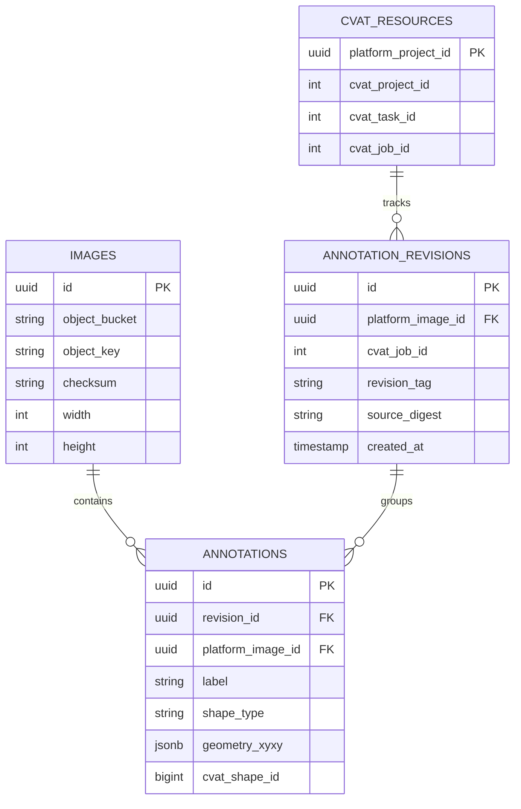
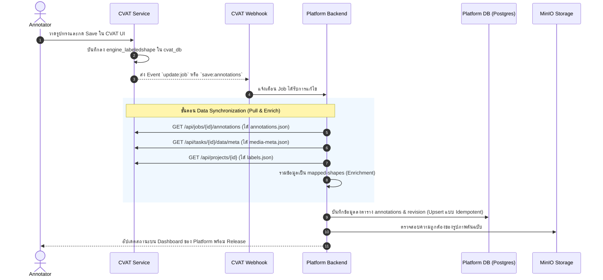

# คู่มืออธิบายการเชื่อมต่อ CVAT Database และ REST API สำหรับ Backend Developer

**จัดทำขึ้นเพื่อ:** อธิบายให้ Backend Developer เข้าใจความเชื่อมโยงระหว่างโครงสร้างภายในของ CVAT (PostgreSQL), ผลลัพธ์จาก REST API (`examples/api-results`) และรูปแบบข้อมูลที่ Backend ต้องนำไปจัดเก็บใน Database ของ Platform

← [สารบัญเอกสาร](00_DOCUMENT-INDEX-TH.md)

---

## 1. หลักการออกแบบสำคัญ (Core Architectural Principles)

```
[ Frontend / User ]
        │
        ▼ (Keycloak Auth / Business Workflow)
[ Platform Backend ] ───────────────► [ Platform Database (PostgreSQL) ]
        │                                  (เก็บภาพ, งาน, Annotations กลาง, Release)
        │ REST API / SDK / Webhook
        ▼
   [ CVAT Service ] ─────────────────► [ CVAT Database (PostgreSQL: cvat_db) ]
                                           (เก็บโครงสร้างภายในเฉพาะของ CVAT เท่านั้น)
```

1. **ห้าม Backend เขียน SQL แก้ไข CVAT Database โดยตรงเด็ดขาด:**
   * CVAT มีระบบ Cache (Redis/In-memory), Task Locking, OPA Policy และระบบ Event/Trigger ภายใน หากไป `INSERT`/`UPDATE` ผ่าน SQL ตรงๆ จะทำให้ State ของระบบพังและไม่สามารถอัปเกรดเวอร์ชันได้
2. **Platform DB และ CVAT DB ทำหน้าที่คนละอย่าง:**
   * **CVAT DB (`cvat_db`):** เป็น Database ชั่วคราวเฉพาะทาง ทำหน้าที่ดูแล UI การวาดกรอบ, Tooling, Job Slits และสถานะการ Assign ภายใน Tool
   * **Platform DB (เช่น `ptt_postgres`):** เป็น Single Source of Truth สำหรับ Business Data, ข้อมูลไฟล์ภาพใน MinIO, สิทธิ์ผู้ใช้งาน, ประวัติ Revision และ Dataset Release

---

## 2. ความสัมพันธ์ระหว่าง CVAT Database (PostgreSQL) กับ REST API

เมื่อเข้าไปดูใน `cvat_db` ผ่าน DBeaver จะเห็นตารางจริง ซึ่งเชื่อมโยงกับผลลัพธ์จาก REST API ดังตารางต่อไปนี้:

| ข้อมูลใน REST API (`annotations.json`) | ตารางใน CVAT DB | คอลัมน์ที่สอดคล้องกัน | ความหมาย |
| :--- | :--- | :--- | :--- |
| `shapes[].id` (เช่น `242`) | **`engine_labeledshape`** | `id` (PK) | รหัสประจำตัวของกรอบนั้นๆ |
| `shapes[].label_id` (เช่น `35`) | **`engine_label`** | `id` (FK) | รหัสคลาส (ต้อง Query หา `name` เช่น `"flange"`) |
| `shapes[].frame` (เช่น `0`) | **`engine_labeledshape`** | `frame` | ลำดับรูปภาพใน Task นั้น (เริ่มจาก `0`) |
| `shapes[].type` (เช่น `rectangle`) | **`engine_labeledshape`** | `type` | ชนิดรูปทรง (`rectangle`, `polygon`, `points`) |
| `shapes[].points` (เช่น `[x1, y1, x2, y2]`) | **`engine_labeledshape`** | `points` | พิกัดการวาด (ใน DB เก็บเป็น string คั่นด้วยจุลภาค) |
| `tracks[]` | **`engine_labeledtrack`** +<br>**`engine_trackedshape`** | `id`, `frame`, `points` | วัตถุในวิดีโอที่ลากต่อเนื่องข้ามหลายเฟรม |
| `tags[]` | **`engine_labeledimage`** | `id`, `label_id`, `frame` | การแปะ Tag ระดับรูปภาพทั้งรูป (ไม่มีพิกัด) |
| Media metadata (frame `0` $\rightarrow$ `008835.jpg`) | **`engine_image`** / **`engine_data`** | `path`, `width`, `height` | ข้อมูลภาพจริงที่นำเข้ามาใน Task |

---

## 3. ทำไม REST API ถึงให้ผลลัพธ์แยกเป็นหลายไฟล์ใน `examples/api-results`?

ในโฟลเดอร์ [`examples/api-results`](../examples/api-results) มีไฟล์ตัวอย่างที่ได้จากการเรียก REST API:

1. **`annotations.json`** (`GET /api/jobs/{job_id}/annotations`):
   * คืนเฉพาะพิกัดและ ID ดิบ เพื่อประหยัดขนาด Payload ของเครือข่าย เพราะงานหนึ่งอาจมีหมื่นกว่ากรอบ
2. **`labels.json`** (`GET /api/projects/{project_id}` หรือ `GET /api/tasks/{task_id}`):
   * คืนโครงสร้าง Label Schema ทั้งหมด เพื่อใช้ถอดรหัสว่า `label_id: 35` คือ `"flange"`
3. **`media-meta.json`** (`GET /api/tasks/{task_id}/data/meta`):
   * คืนข้อมูล Frame Index เทียบกับชื่อไฟล์จริง เพื่อบอกว่า `frame: 0` คือรูปภาพ `"008835.jpg"` และมีขนาด `1920x1080`
4. **`mapped-shapes.json`**:
   * **ไม่ใช่ไฟล์จาก CVAT โดยตรง** แต่เป็นตัวอย่างของข้อมูลที่ **Backend ต้องนำ 3 ไฟล์ข้างต้นมา Join (Map) เข้าด้วยกัน** ก่อนนำไปบันทึกลง Platform DB

---

## 4. โครงสร้างข้อมูลที่ Backend ต้องการเพื่อนำไปลง Platform Database

การแปลงข้อมูลจาก CVAT ไปยัง Platform Database จะมี **2 ขั้นตอน (2 Stages)** ดังนี้:

### ขั้นที่ 1: ผลลัพธ์จากการ Map ข้อมูลภายใน CVAT (`mapped-shapes.json`)
ไฟล์ [`examples/api-results/mapped-shapes.json`](../examples/api-results/mapped-shapes.json) คือตัวอย่างที่นำข้อมูลภายใน CVAT อย่างเดียว (`annotations.json` + `labels.json` + `media-meta.json`) มา Join กัน ซึ่งยังไม่มีข้อมูลของ Platform:

```json
{
  "frame": 0,
  "image_name": "008835.jpg",
  "width": 1920,
  "height": 1080,
  "label": "flange",
  "type": "rectangle",
  "points": [817.5, 680.0, 1075.0, 948.75],
  "rotation": 0.0
}
```

---

### ขั้นที่ 2: ข้อมูลที่ Backend นำไปผูกกับ Platform DB (Platform Unified Schema)
Backend จะนำผลลัพธ์จากขั้นที่ 1 ไปผูกเข้ากับข้อมูลในระบบ Platform (ค้นหา `image_name` เพื่อเอา `platform_image_id`, เติม `source` อ้างอิง CVAT, และใส่ `revision_id`) ก่อนบันทึกลง Platform DB:

```json
{
  "platform_image_id": "img-999",               // Backend นำ "008835.jpg" ไป Query หา ID จาก Platform DB
  "image_name": "008835.jpg",
  "width": 1920,
  "height": 1080,
  "label": "flange",                            // ชื่อคลาสจริง
  "geometry": {
    "type": "rectangle",
    "xyxy": [817.5, 680.0, 1075.0, 948.75]       // พิกัด Bounding Box
  },
  "source": {                                   // เก็บ ID ของ CVAT ไว้อ้างอิงและทำ Audit
    "cvat_instance": "cvat-local",
    "task_id": 55,
    "job_id": 81,
    "shape_id": 242
  },
  "revision_id": "rev-0001"                     // Backend กำหนด revision ของรอบที่ sync
}
```

### 4.2 โครงสร้างตารางขั้นต่ำที่ต้องมีใน Platform Database:



---

## 5. End-to-End Workflow การทำงานของ Backend



---

## 6. สรุปข้อปฏิบัติและข้อควรระวังสำหรับ Backend Developer

| สิ่งที่ควรทำ (Best Practices) | สิ่งที่ไม่ควรทำ (Anti-Patterns) |
| :--- | :--- |
| **เชื่อมต่อผ่าน REST API และ Webhook** เท่านั้น | **ห้ามเขียน SQL** ลง `cvat_db` โดยตรง |
| **ทำ Idempotent Upsert** โดยเช็ค `source_digest` หรือ `cvat_shape_id` เพื่อป้องกันข้อมูลซ้ำซ้อน | **ห้ามใช้คำสั่ง INSERT อย่างเดียว** เพราะการ Sync ซ้ำจะทำให้กรอบซ้ำ |
| **ใช้ Webhook เป็น Trigger** แล้วค่อยยิง API ไปดึงข้อมูลล่าสุดมาประมวลผล | **อย่าคิดว่า Webhook Payload จะมีกรอบทั้งหมด** (CVAT Webhook มักส่งแค่ Event metadata) |
| **ทำ Reconciliation ประจำรอบ** เผื่อมีกรณี Webhook หายระหว่าง Network มีปัญหา | **ห้ามสั่ง Export ZIP ตลอดเวลา** เพื่อนำมาอ่านข้อมูล ให้ใช้ REST API เท่านั้น (ZIP มีไว้สำหรับ Release Dataset) |

---

## 7. ขอบเขตความรับผิดชอบในการแปลงข้อมูล (Data Enrichment Responsibility)

### คำถามสำคัญ: ใครเป็นคนแปลง (Enrich) ข้อมูลให้กลายเป็น `mapped-shapes.json`?
**คำตอบ: "Backend ต้องเป็นผู้ดึงข้อมูลไปแปลง (Enrich) เองใน Service/Worker ของฝั่ง Backend"**

### เหตุผลตามสถาปัตยกรรมระบบ:
1. **CVAT เป็น Standalone Service:** CVAT มีหน้าที่จัดการการ Annotate และให้ REST API มาตรฐานตามโครงสร้างของตนเอง โดยไม่ทราบ Business Schema หรือ Database Model ของ Platform
2. **Platform Backend เป็นเจ้าของ Business Logic และ Database:** Backend ต้องนำข้อมูลที่ได้ไปเชื่อมกับ `platform_image_id` ใน MinIO และทำ Database Transaction ลงใน Platform DB ตามที่ระบุไว้ในเอกสารสถาปัตยกรรม [`docs/16_BACKEND-DEVELOPER-HANDOFF-TH.md`](16_BACKEND-DEVELOPER-HANDOFF-TH.md)

### ตารางแบ่งหน้าที่ความรับผิดชอบ (Separation of Concerns):

| ส่วนงาน | ฝั่งเรา (AI / CVAT Integrator) | ฝั่ง Backend Developer |
| :--- | :--- | :--- |
| **หน้าที่รับผิดชอบ** | • ติดตั้งและดูแล CVAT Service<br>• เตรียม API Spec และ Webhook Configuration<br>• **เตรียมโค้ดตัวอย่างการ Map ให้ Backend** | • รับ Webhook Event หรือสั่งดึงตามรอบ Sync<br>• เรียก CVAT REST API อ่านข้อมูล<br>• **รัน Logic รวมร่างข้อมูล (Enrichment)**<br>• บันทึกลง Platform Database |
| **สิ่งที่ส่งมอบ** | ตัวอย่าง Payload (`annotations.json`, `labels.json`, `media-meta.json`) และผลลัพธ์ตัวอย่าง **`mapped-shapes.json`** | เขียน Service/Worker เพื่อนำข้อมูลไปใช้งานจริงในระบบ Platform |

### โค้ดตัวอย่าง Logic การ Map สำหรับ Backend (นำไปปรับใช้ได้ทันที):
อ้างอิงจากตัวอย่างใน [`examples/sdk/local_dataset.py`](../examples/sdk/local_dataset.py):

```python
# 1. ดึงข้อมูล 3 ส่วนจาก CVAT REST API / SDK
annotations = job.get_annotations().to_dict()       # พิกัดดิบ (annotations.json)
meta = task.get_meta().to_dict()                     # ข้อมูล Frame และชื่อภาพ (media-meta.json)
labels = [l.to_dict() for l in task.get_labels()]    # ข้อมูล Label (labels.json)

# 2. ทำ Dictionary เพื่อ Map label_id -> label_name
label_names = {label["id"]: label["name"] for label in labels}

# 3. วนลูปแปลงข้อมูล (Enrichment / Mapping)
mapped_rows = []
for shape in annotations["shapes"]:
    frame_index = shape["frame"]
    image_info = meta["frames"][frame_index]         # ดึงชื่อภาพจาก frame index
    
    mapped_rows.append({
        "shape_id": shape["id"],
        "frame": frame_index,
        "image_name": image_info["name"],           # ชื่อไฟล์ภาพจริงใน MinIO/ระบบ
        "label": label_names[shape["label_id"]],    # ชื่อคลาสจริง (เช่น "flange")
        "type": shape["type"],                      # ชนิดรูปทรง (เช่น "rectangle")
        "points": shape["points"],                  # พิกัด Bounding Box [x1, y1, x2, y2]
        "rotation": shape.get("rotation", 0)
    })

# 4. Backend นำ mapped_rows ไป Upsert ลงตาราง annotations ใน Platform Database
```
