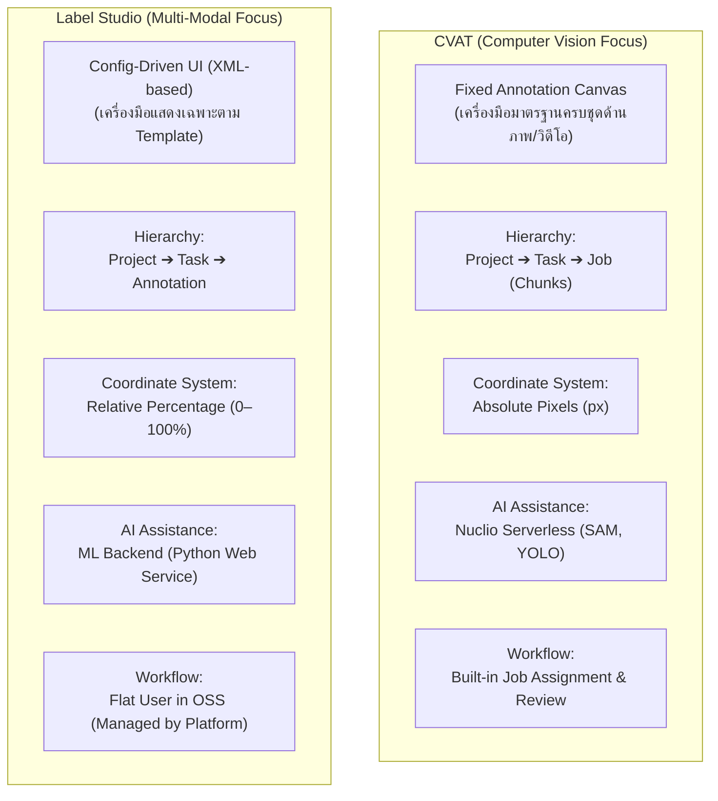
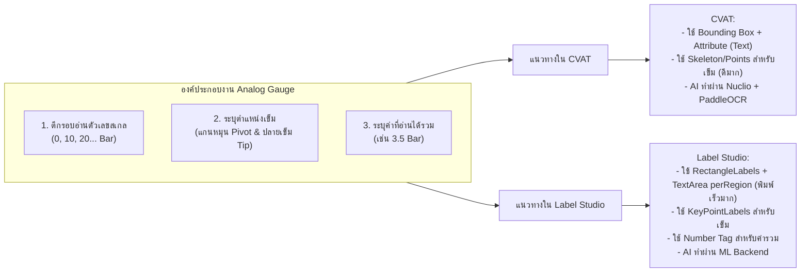

# 20 — การเปรียบเทียบสถาปัตยกรรมและเกณฑ์เลือกใช้: Label Studio vs CVAT

[สารบัญเอกสาร](00_DOCUMENT-INDEX-TH.md) · [สถาปัตยกรรม Platform](01_AI-PLATFORM-CVAT-INTEGRATION-ARCHITECTURE-TH.md) · [คู่มือ Label Studio Frontend](15_LABEL-STUDIO-FRONTEND-INTEGRATION-GUIDE-TH.md)

← [สารบัญเอกสาร](00_DOCUMENT-INDEX-TH.md)

สำหรับ Backend Architect, Data Engineer และทีม AI; ตรวจสอบหลักฐานเมื่อ 23 กันยายน 2026 บน **Label Studio Community 1.23.0** และ **CVAT Community 2.x/dev**.
เอกสารนี้สรุปความแตกต่างเชิงสถาปัตยกรรม โครงสร้างข้อมูล และกรณีศึกษาเฉพาะทาง (เช่น งานอ่านค่าเกจวัดอนาล็อกและ OCR) เพื่อใช้ตัดสินใจเลือกและวางระบบร่วมกับ AI Platform

## ภาพประกอบจากการทดสอบ

ภาพต่อไปนี้เป็น screenshot ที่ใช้ประกอบการเปรียบเทียบหน้าจอและเครื่องมือ annotation ภายในเอกสารนี้

## 1. ภาพรวมสถาปัตยกรรมหลัก (Core Architecture Comparison)



## 2. ตารางเปรียบเทียบเชิงลึกรายด้าน


| มิติการเปรียบเทียบ                                    | CVAT (Community Edition)                                                                                                                              | Label Studio (Community Edition)                                                                                                                  | ผลกระทบต่อ Backend &amp; การออกแบบระบบ                                                                                                             |
| ----------------------------------------------------- | ----------------------------------------------------------------------------------------------------------------------------------------------------- | ------------------------------------------------------------------------------------------------------------------------------------------------- | -------------------------------------------------------------------------------------------------------------------------------------------------- |
| **1. ปรัชญาการออกแบบหน้าจอ (UI Paradigm)**            | **Fixed Canvas UI:** หน้าจอถูกออกแบบมาสำหรับ Computer Vision โดยเฉพาะ มีแถบเครื่องมือมาตรฐานครบทุกชนิดคงที่อยู่ด้านซ้าย                               | **Config-Driven UI:** UI สร้างแบบพลวัต (Dynamic) ตามโครงสร้าง **XML Labeling Setup** เครื่องมือที่ไม่ระบุใน Template จะไม่ปรากฏบนหน้าจอ           | Label Studio ช่วยให้หน้าจอ Clean และผู้ทำไม่สับสน แต่ถ้าต้องการหลายเครื่องมือในโปรเจกต์เดียวกัน ต้องออกแบบ XML Tag ให้ครบตั้งแต่แรก                |
| **2. ขอบเขตชนิดข้อมูล (Modality Support)**            | **Computer Vision เฉพาะทาง:** ภาพ (Images), วิดีโอ (Videos), และ 3D Point Cloud (LiDAR)                                                               | **Multi-Modal ครอบคลุม:** รองรับภาพ, วิดีโอ, เสียง (Audio), ข้อความ (NLP/NER), Time-series, HTML, และ LLM/Chat RLHF                               | หากระบบต้องรองรับหลายโดเมนข้อมูล Label Studio รวมศูนย์ได้ในตัวเดียว หากเน้นเฉพาะ Vision CVAT มีเครื่องมือวาดที่ลึกกว่า                             |
| **3. ระบบพิกัดเรขาคณิต (Coordinate System)**          | **Absolute Pixels (px):** บันทึกเป็นพิกเซลจริงเทียบกับความละเอียดภาพต้นฉบับ เช่น `[xtl, ytl, xbr, ybr]`                                               | **Relative Percentage (0–100%):** บันทึกเป็นเปอร์เซ็นต์สัมพัทธ์ เช่น `x: 12.5, y: 25.0, width: 30.0, height: 40.0`                                | Label Studio ปรับขนาดตามหน้าจอแสดงผลได้อัตโนมัติ แต่ **Backend ต้องนำ % ไปคูณขนาดภาพจริง (Width/Height)** ก่อนแปลงเป็นฟอร์แมตเทรนโมเดล (YOLO/COCO) |
| **4. ลำดับชั้นและการแบ่งงาน (Data Hierarchy)**        | **Project ➔ Task ➔ Job:** รองรับการแบ่ง Task ก้อนใหญ่ (เช่น 1,000 รูป) ออกเป็น **Job ย่อย** (เช่น 100 รูป/Job) เพื่อกระจายให้หลายคนทำพร้อมกัน         | **Project ➔ Task ➔ Annotation:** 1 Task = 1 หน่วยข้อมูล (เช่น 1 ภาพ หรือ 1 ข้อความ) ไม่มีคอนเซ็ปต์ Job ในตัว                                      | CVAT แจกจ่ายงานได้ละเอียดกว่าในระดับ Job; Label Studio Community ต้องให้ Platform หรือคิวงานภายนอกคุมการจ่าย Task ผ่าน API                         |
| **5. งานวิดีโอ (Video Tracking &amp; Interpolation)** | **มีประสิทธิภาพสูงมาก:** มีระบบ Track ID, **Interpolation อัตโนมัติข้ามเฟรม**, และการแบ่ง Chunk สตรีมมิ่งที่โหลดวิดีโอยาวได้รวดเร็ว                   | **พื้นฐาน:** รองรับแท็ก `<Video>` แต่ระบบ Track ข้ามเฟรมอัตโนมัติยังไม่ลื่นไหลเท่า CVAT เหมาะกับคลิปสั้นหรืองานจัดหมวดหมู่วิดีโอ                  | หากมีโจทย์งาน Video Tracking วัตถุข้ามเฟรมจำนวนมาก CVAT มีความพร้อมใช้งานสูงกว่า                                                                   |
| **6. สิทธิ์ผู้ใช้และระบบ Review (OSS Edition)**       | **มีระบบ Role &amp; Review ในตัว:** มีสิทธิ์ Admin, Supervisor, Annotator และมีสถานะ Job Review (`Annotation` ➔ `Validation` ➔ `Accepted`/`Rejected`) | **Flat Permission ในรุ่นฟรี:** สิทธิ์ผู้ใช้ใน Community เท่ากันทั้งหมด ฟีเจอร์ RBAC, การ Assign รายคน และ Review แบบแยกบทบาทอยู่ในรุ่น Enterprise | ใน Label Studio OSS ควรกำหนดให้ **Platform Database เป็นตัวถือสถานะ QA/Approval** และใช้ Webhook/API ในการควบคุมสิทธิ์                             |
| **7. การต่อโมเดล AI ช่วยทำ Label (AI Assistance)**    | **Nuclio Serverless Framework:** เชื่อมต่อและ Deploy โมเดลสำเร็จรูป (เช่น SAM, YOLO, Trackers) เป็น Docker container ภายในระบบ                        | **ML Backend:** รัน Python Web Service แยกต่างหากเพื่อรับ Webhook ไปทำ Ingestion, คืนค่า `predictions` และรองรับ Active Learning                  | Nuclio สะดวกสำหรับโมเดล Vision ทั่วไป แต่ ML Backend ของ Label Studio ยืดหยุ่นในการเขียน Business Logic และรองรับโมเดลทุกโดเมน                     |
| **8. การเชื่อมต่อ Object Storage (MinIO/S3)**         | เชื่อม Cloud Storage ผ่าน Cloud Storage Provider / Manifest                                                                                           | มีเมนู **Cloud Storage Sync** ในตัว ทั้ง **Source Storage** (อ่านภาพเข้า) และ **Target Storage** (บันทึกผลออก)                                    | ทั้งคู่เชื่อม MinIO ได้ดี โดย Label Studio มีระบบ Polling/Webhook ตรวจจับไฟล์ใหม่ใน Bucket ได้สะดวก                                                |


## 3. กรณีศึกษาเฉพาะทาง: การอ่านค่าและวัดค่าบนเกจวัดอนาล็อก (Analog Gauge Reading &amp; OCR)

งานอ่านค่าเกจวัดเข็มทางอุตสาหกรรม มักประกอบด้วย 3 องค์ประกอบย่อย:

1. **การหาตำแหน่งหน้าปัดและตัวเลขสเกล (Face &amp; Scale OCR)**
2. **การจับตำแหน่งและมุมของเข็ม (Needle Pivot &amp; Tip / Angle Measurement)**
3. **การบันทึกค่าที่อ่านได้จริง (Ground Truth Value)**



### การเปรียบเทียบในเคสนี้:


| ภารกิจ                                          | ใน CVAT                                                                                                          | ใน Label Studio                                                                                              | ข้อสรุปความเหมาะสม                                                                    |
| ----------------------------------------------- | ---------------------------------------------------------------------------------------------------------------- | ------------------------------------------------------------------------------------------------------------ | ------------------------------------------------------------------------------------- |
| **การพิมพ์ค่าตัวเลข (OCR Data Entry)**          | ใช้ Label `digit` ร่วมกับ **Attribute ชนิด Text**: วาดกล่องแล้วต้องเลื่อนเมาส์ไปคลิกพิมพ์ที่แถบขวา (หลายขั้นตอน) | ใช้แท็ก `<TextArea perRegion="true"/>`: **วาดกล่องเสร็จ กล่องพิมพ์ข้อความจะเด้งขึ้นมาตรงจุดนั้นทันที**       | **Label Studio ชนะ:** ความเร็วในการป้อนข้อความและการ Review เร็วกว่าอย่างเห็นได้ชัด   |
| **การวัดมุมเข็ม (Needle Angle / Keypoints)**    | มีระบบ **Skeleton และ Points** ที่กำหนด Bone/Edge เชื่อมจุดแกนหมุน (Pivot) ไปยังปลายเข็ม (Tip) ได้อย่างแม่นยำ    | รองรับ `<KeyPointLabels>` แต่การเชื่อมโยงความสัมพันธ์ระหว่าง 2 จุดให้เป็นโครงสร้างเชิงเรขาคณิตทำได้จำกัดกว่า | **CVAT ชนะ:** เหมาะกับงานที่ต้อง Train โมเดลสาย Pose/Keypoint Detection เชิงลึก       |
| **การกรอกค่ารวมทั้งภาพ (Global Reading Value)** | ต้องใช้ Frame Tag หรือกำหนด Attribute ให้กับรูปภาพทั้งใบ                                                         | ใช้แท็ก `<Number name="gauge_reading" toName="image"/>` ปรากฏเป็นช่องกรอกตัวเลขเด่นชัดบน UI ทันที            | **Label Studio ชนะ:** ออกแบบ Input ควบคุมชนิดข้อมูล (Numeric Range) ได้ตรงความต้องการ |


#### ตัวอย่าง Template XML สำหรับงาน Gauge ใน Label Studio (`gauge_config.xml`):

```xml
<View>
  <Image name="image" value="$image"/>

  <!-- 1. ระบุตำแหน่งแกนหมุนและปลายเข็ม -->
  <KeyPointLabels name="needle_points" toName="image">
    <Label value="Pivot" background="red"/>
    <Label value="Tip" background="green"/>
  </KeyPointLabels>

  <!-- 2. ตีกรอบตัวเลขสเกล พร้อมช่องพิมพ์ค่า OCR รายกรอบ -->
  <RectangleLabels name="scale_labels" toName="image">
    <Label value="ScaleDigit" background="blue"/>
  </RectangleLabels>
  <TextArea name="scale_text" toName="image" perRegion="true"
            placeholder="พิมพ์ตัวเลขสเกล..." displayMode="region-list"/>

  <!-- 3. ช่องกรอกค่าสรุปของเกจทั้งภาพ -->
  <Header value="ค่าที่อ่านได้จริง (Ground Truth Value)"/>
  <Number name="true_value" toName="image" placeholder="เช่น 2.45"/>
</View>
```

## 4. เกณฑ์การเลือกใช้เครื่องมือสำหรับสถาปัตยกรรมระบบ (Decision Matrix)


| สถานการณ์ของโครงการ                                                                    | เครื่องมือที่แนะนำ | เหตุผลทางเทคนิค                                                                                                        |
| -------------------------------------------------------------------------------------- | ------------------ | ---------------------------------------------------------------------------------------------------------------------- |
| มีงานประเภท **Video Tracking ข้ามเฟรมยาวๆ** หรือเน้น Interpolation                     | **CVAT**           | มีเอนจินจัดการ Chunk วิดีโอและ Track ID ที่สมบูรณ์แบบโดยไม่ต้องพัฒนาเพิ่ม                                              |
| มีงานประเภท **LiDAR / 3D Point Cloud**                                                 | **CVAT**           | CVAT Community รองรับ 3D Point Cloud Annotation ในตัว                                                                  |
| ต้องการระบบ **แบ่งงานเป็น Job รายคน และมีสถานะ Review ในตัว** โดยไม่เขียน Backend ครอบ | **CVAT**           | CVAT Community มี Role, Task Chunks, และ Review State พร้อมในระบบ                                                      |
| งานที่มี **ข้อความ (NLP), เสียง (Audio), เอกสาร หรือ OCR เข้มข้น**                     | **Label Studio**   | เอนจิน XML รองรับ Tag ชนิด Text, Audio Waveform, TextArea ได้อย่างสมบูรณ์                                              |
| งานประเภท **Multi-modal ผสมผสาน** (เช่น ภาพ + OCR + ประเมินคะแนน + กรอกตัวเลข)         | **Label Studio**   | การกำหนด Config-driven UI ผ่าน XML ทำให้ออกแบบหน้าจอเฉพาะทางได้อิสระ                                                   |
| สถาปัตยกรรมที่ **มี AI Platform Backend เป็นผู้คุมคิวงานและ Business Logic เอง**       | **Label Studio**   | สถาปัตยกรรม REST API, Webhook, และ JSON Payload ของ Label Studio เชื่อมต่อกับ Backend ภายนอกได้เรียบง่ายและยืดหยุ่นสูง |


## 5. แหล่งอ้างอิงและเอกสารที่เกี่ยวข้อง

1. [Label Studio Community Documentation](https://labelstud.io/guide/) (ตรวจข้อมูลกันยายน 2026)
2. [Label Studio Tags Reference](https://labelstud.io/tags/)
3. [CVAT Official Documentation](https://docs.cvat.ai/)
4. เอกสารสถาปัตยกรรม Platform: `[docs/01_AI-PLATFORM-CVAT-INTEGRATION-ARCHITECTURE-TH.md](01_AI-PLATFORM-CVAT-INTEGRATION-ARCHITECTURE-TH.md)`
5. ตารางเปรียบเทียบฟีเจอร์หน้า Annotate: `docs/18_ANNOTATION-EDITOR-FEATURE-MATRIX-TH.md`