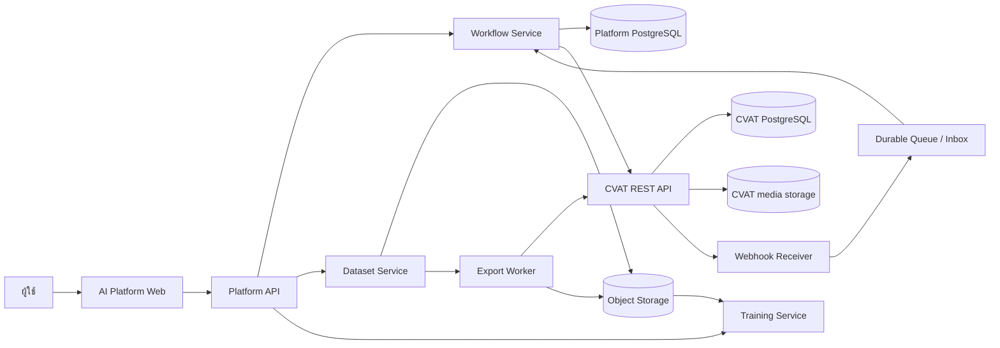

# แนวทางออกแบบ AI Platform ที่ใช้ CVAT เป็น Annotation Service

เอกสารนี้เป็นแนวทางสำหรับสร้างแพลตฟอร์ม AI แบบ Roboflow โดยให้แพลตฟอร์มเป็นเจ้าของ dataset, workflow และ training ส่วน CVAT เป็นบริการสำหรับวาด annotation และตรวจสอบคุณภาพ การติดตั้งระยะแรกสามารถอยู่บนเครื่องเดียวกันได้ แต่ควรแบ่งขอบเขตบริการและข้อมูลตั้งแต่ต้น เพื่อให้ย้ายไปหลายเครื่องหรือ Kubernetes ได้ภายหลัง

## 1. หลักการออกแบบ

1. แพลตฟอร์มหลักเป็น **system of record ของ business workflow** เช่น work order, priority, SLA, release และ training run
2. CVAT เป็น **system of record ของ annotation** เช่น Task, Job, Label, shape, Issue และ Comment
3. ติดต่อ CVAT ผ่าน REST API/SDK และ Webhook เป็นหลัก ไม่อ่านหรือแก้ PostgreSQL ของ CVAT เพื่อทำธุรกรรม
4. เก็บ mapping ระหว่าง ID ของแพลตฟอร์มกับ ID ของ CVAT ในฐานข้อมูลของแพลตฟอร์ม
5. เก็บไฟล์ต้นฉบับและไฟล์ผลลัพธ์ใน object storage หรือ managed storage และเก็บ URI/checksum ในฐานข้อมูล
6. ทุกการเปลี่ยนแปลงที่มีผลต่อ workflow ต้องมี audit trail และ correlation ID

## 2. ภาพรวมระบบ



### บทบาทของแต่ละส่วน

| ส่วน | หน้าที่ | ข้อมูลที่ควรเป็นเจ้าของ |
|---|---|---|
| Web UI | หน้าจอ dataset, queue, review และ training | ไม่ควรเชื่อม DB โดยตรง |
| Platform API | authentication, authorization และ business API | สัญญา API ให้ frontend/dev ใช้ |
| Workflow Service | จัดคิว มอบหมาย SLA และ approval | สถานะธุรกิจและ audit |
| Dataset Service | รับไฟล์ สร้าง manifest และ version | dataset version, checksum, split |
| CVAT | annotation และ review รายภาพ/Job | labels, shapes, issues, comments |
| Webhook Receiver | รับ event จาก CVAT | inbox และการ deduplicate |
| Object Storage | ไฟล์ภาพ, export และ model artifact | binary files |
| Platform PostgreSQL | ข้อมูลอ้างอิงและ projection | mapping, release, commands, reports |
| Redis/Queue | งานชั่วคราวหรือ async queue | ห้ามใช้เป็นฐานข้อมูลถาวร |

## 3. รูปแบบการเปิด CVAT บนหน้าเว็บ

### ทางเลือกที่แนะนำ: deep link

Platform แสดงปุ่ม `Open annotation` แล้วเปิด URL ของ CVAT Job เช่น:

```text
https://cvat.example.com/tasks/2/jobs/2
```

ข้อดีคือไม่ต้องแก้ CVAT frontend และ debug ง่าย เหมาะกับ MVP และ production รุ่นแรก Platform ตรวจสิทธิ์ก่อนออกลิงก์ และใช้ API อ่านสถานะกลับมา

### iframe หรือ web screen

ทำได้ แต่ต้องจัดการ CSP, `X-Frame-Options`, cookie `SameSite`, SSO และการสื่อสารระหว่าง origin การฝัง iframe ไม่ได้ทำให้ข้อมูล CVAT กลายเป็นข้อมูลของ Platform และไม่ควรให้ browser เรียกฐานข้อมูลโดยตรง

ถ้าต้องการ UX แบบหน้าเดียว แนะนำใช้ reverse proxy และ SSO เดียวกันก่อน แล้วค่อยฝัง iframe หลังทดสอบ security policy สำเร็จ การ fork CVAT frontend ควรทำเมื่อมีข้อกำหนด UI ที่ deep link และ iframe แก้ไม่ได้ เพราะเพิ่มภาระ merge และ upgrade

## 4. Data input: ข้อมูลเข้าระบบ

### 4.1 Dataset upload

ผู้ใช้ส่ง dataset เข้า Platform ไม่ควรส่งจาก browser ไป PostgreSQL CVAT โดยตรง ลำดับที่แนะนำ:

```text
Browser → Platform API → Object Storage (raw upload)
                         ↓
                    Validate worker
                         ↓
                 Dataset version + manifest
                         ↓
                Create CVAT Task via API
```

ตัวอย่าง request ฝั่ง Platform:

```http
POST /api/datasets
Content-Type: application/json

{
  "name": "ptt-inspection",
  "source_type": "upload",
  "format": "yolo11",
  "files": [
    {"object_key": "raw/ptt-inspection/train.zip", "sha256": "...", "size_bytes": 1825361100}
  ],
  "labels": ["actuator", "pump", "valve-body"],
  "split": {"train": 0.8, "valid": 0.1, "test": 0.1}
}
```

ระบบควรตรวจชนิดไฟล์, ขนาด, checksum, path traversal, จำนวนรูป, จำนวน label, ความสัมพันธ์ระหว่าง image กับ annotation และ encoding ของ YAML ก่อนสร้าง CVAT Task

### 4.2 Dataset manifest

Manifest เป็นตัวกลางระหว่าง binary files กับฐานข้อมูล ไม่ควรใช้ชื่อไฟล์อย่างเดียวเป็น identity:

```json
{
  "dataset_id": "ds_01J...",
  "version": 3,
  "created_at": "2026-09-17T10:00:00Z",
  "source": {"object_uri": "s3://ai-data/raw/ptt.zip", "sha256": "..."},
  "items": [
    {
      "item_id": "img_000001",
      "object_uri": "s3://ai-data/raw/images/a.jpg",
      "width": 1920,
      "height": 1080,
      "split": "train",
      "source_annotation": "labels/a.txt"
    }
  ],
  "classes": [{"id": 0, "name": "actuator"}]
}
```

เก็บ manifest ที่ immutable ต่อ version เพื่อให้ย้อนกลับได้ว่า training run ใช้รูปและ label ชุดใด

### 4.3 สร้าง CVAT Task

Platform สร้าง Project/Task และส่งไฟล์ให้ CVAT ผ่าน API หรือกำหนด Cloud Storage ให้ CVAT อ่าน object storage เดียวกัน ตัวอย่าง mapping:

```json
{
  "dataset_version_id": "dsv_01J...",
  "cvat_instance": "cvat-prod-01",
  "cvat_organization_id": 1,
  "cvat_project_id": 3,
  "cvat_task_id": 2,
  "cvat_job_ids": [2, 3, 4]
}
```

สร้าง mapping หลัง CVAT ตอบสำเร็จเท่านั้น ถ้า request timeout ให้ค้นหาด้วย external name/command record ก่อน retry เพื่อป้องกันสร้าง Task ซ้ำ

## 5. Data output: ข้อมูลออกจาก CVAT

### 5.1 สถานะ workflow

Platform อ่านผ่าน API:

```http
GET /api/jobs?org=1&page_size=100
GET /api/issues?org=1&job_id=2&resolved=false
```

ข้อมูลที่ควรนำมาเก็บเป็น projection:

```json
{
  "cvat_job_id": 2,
  "platform_work_item_id": "wi_01J...",
  "assignee": "annotator01",
  "stage": "acceptance",
  "state": "completed",
  "status": "completed",
  "open_issue_count": 0,
  "last_synced_at": "2026-09-17T10:14:00Z"
}
```

`stage`, `state` และ `status` เป็นสถานะของ CVAT ส่วน `business_status` เช่น `READY_FOR_TRAINING` หรือ `APPROVED_BY_ENGINEER` ควรอยู่ใน Platform เพราะเป็นกติกาธุรกิจ

### 5.2 Export annotation

เมื่อผ่าน approval แล้ว Export Service เรียก CVAT export API แบบ asynchronous รอ request เสร็จ แล้วเก็บ artifact ใน object storage:

```text
CVAT export → temporary file → validate → canonical artifact
                           ↓
                 checksum + manifest + release
```

ข้อมูล output ที่ควรเก็บ:

```json
{
  "release_id": "rel_01J...",
  "dataset_version_id": "dsv_01J...",
  "source_cvat": {"project_id": 3, "task_id": 2, "job_ids": [2]},
  "format": "YOLO 1.1",
  "artifact_uri": "s3://ai-data/releases/rel_01J.zip",
  "sha256": "...",
  "image_count": 20,
  "annotation_count": 241,
  "class_count": 26,
  "approved_by": "reviewer01",
  "approved_at": "2026-09-17T10:20:00Z"
}
```

ก่อนส่งเข้า training ให้ตรวจว่าจำนวนภาพ, labels, class mapping, image dimensions และ checksum ตรงกับ manifest หากไม่ตรงต้องสร้าง release ใหม่ ไม่แก้ไฟล์เดิมแบบ in-place

### 5.3 Training input

Training Service ควรรับ `release_id` ไม่รับ path ของ CVAT โดยตรง:

```json
{
  "release_id": "rel_01J...",
  "framework": "ultralytics",
  "model": "yolo11n.pt",
  "parameters": {"epochs": 100, "imgsz": 640, "batch": 16}
}
```

Worker ดึง artifact จาก object storage ด้วย short-lived credentials และบันทึก code version, container image, parameters, metrics และ model URI กลับเป็น Training Run

## 6. ฐานข้อมูลของ Platform ที่ควรมี

เริ่มด้วย PostgreSQL แยกจาก `cvat_db` โดยมีตารางเชิงธุรกิจประมาณนี้:

```text
users
organizations
workspaces
datasets
dataset_versions
dataset_items
cvat_instances
cvat_projects
cvat_tasks
cvat_jobs
assignments
assignment_history
workflow_events
commands_outbox
webhook_inbox
review_rounds
dataset_releases
training_runs
audit_logs
```

ตัวอย่าง field สำคัญ:

| ตาราง | Field สำคัญ |
|---|---|
| `datasets` | `id`, `name`, `owner_id`, `created_at` |
| `dataset_versions` | `id`, `dataset_id`, `version`, `manifest_uri`, `checksum`, `status` |
| `cvat_tasks` | `platform_id`, `instance_id`, `cvat_task_id`, `cvat_project_id`, `sync_state` |
| `cvat_jobs` | `platform_id`, `cvat_job_id`, `assignee_id`, `stage`, `state`, `last_seen_at` |
| `assignments` | `work_item_id`, `user_id`, `priority`, `due_at`, `status` |
| `commands_outbox` | `command_id`, `target_type`, `target_id`, `payload`, `state`, `attempts` |
| `webhook_inbox` | `event_hash`, `payload_uri`, `verified`, `processed_at`, `error` |
| `dataset_releases` | `source_version_id`, `artifact_uri`, `format`, `checksum`, `approved_by` |
| `training_runs` | `release_id`, `image`, `code_revision`, `parameters`, `metrics`, `artifact_uri` |

ใช้ `cvat_instance_id + cvat_resource_id` เป็น unique key เพราะ ID เช่น Task 2 อาจซ้ำกันใน CVAT คนละ instance เก็บ UUID ภายใน Platform เป็น primary key และใช้ foreign key ระหว่างตารางของ Platform

## 7. การ sync สถานะและ event

CVAT Webhook ควรเป็น trigger ให้ Platform ดึงข้อมูลล่าสุด ไม่ควรถือ payload เป็น source เดียว:

```text
CVAT event → verify signature → webhook_inbox → queue
                                      ↓
                              fetch CVAT API
                                      ↓
                         update projection + audit
```

ต้องรองรับ event ซ้ำ, event มาช้า และ event สลับลำดับ โดยใช้ event hash/ID สำหรับ deduplication และมี reconciliation job ทุก 5–15 นาทีในขอบเขตที่เกี่ยวข้อง

คำสั่งที่เปลี่ยนข้อมูลใช้รูปแบบ outbox:

```text
create command record → call CVAT API → read-after-write → mark success
                                 └────→ retry หรือ manual intervention
```

ไม่ควรใช้ transaction เดียวครอบ Platform PostgreSQL กับ CVAT API เพราะเป็นคนละระบบและไม่มี distributed transaction ร่วมกัน

## 8. สิทธิ์และความปลอดภัย

- ให้ผู้ใช้ login ที่ Platform แล้วใช้ SSO/OIDC หรือกลไก token ที่จัดการโดย backend
- อย่าใส่ CVAT password หรือ PAT ใน frontend และอย่า commit secret ลง Git
- Backend เป็นผู้เรียก CVAT API และตรวจว่า user มีสิทธิ์กับ work item ก่อนออกลิงก์
- ใช้ least privilege: Worker เห็นเฉพาะ Job ที่ได้รับ, Reviewer เห็นงานตรวจ, Coordinator จัดคิว
- จำกัดขนาด upload, ตรวจ archive ก่อนแตกไฟล์ และป้องกัน path traversal
- กำหนด signed URL อายุสั้นสำหรับ object storage
- เปิด audit log สำหรับ assignment, export, approval และ release
- ถ้าใช้ iframe ให้กำหนด CSP `frame-ancestors` และทดสอบ cookie policy กับ domain จริง

## 9. สิ่งที่ไม่ควรทำ

1. ให้ Platform เขียนตรงลง `cvat_db`
2. ใช้ local file path เป็นตัวเชื่อมข้อมูลระหว่าง service
3. ให้ frontend เชื่อม PostgreSQL, Redis หรือ object storage ด้วย credential ถาวร
4. ถือว่าการกด Save annotation คือการส่ง QA เสมอ
5. เปลี่ยน `engine_job.state` เองเพื่อเลื่อน workflow
6. ใช้ชื่อ Task เป็น foreign key แทน ID และ instance
7. แก้ export เดิมหลัง approval โดยไม่สร้าง release/version ใหม่
8. ใช้ Redis เป็นที่เก็บสถานะถาวรหรือ audit trail

## 10. แผนทำระบบแบบค่อยเป็นค่อยไป

### ระยะที่ 1: MVP บนเครื่องเดียว

- Docker Compose: Platform API, Platform PostgreSQL, CVAT และ object storage
- ใช้ deep link ไป CVAT แทน iframe
- สร้าง Dataset Version และ CVAT Task ผ่าน backend
- อ่าน Job status ด้วย API แบบ polling
- Export ZIP ผ่าน UI/API แล้วเก็บ release metadata

### ระยะที่ 2: Workflow อัตโนมัติ

- เพิ่ม Webhook Receiver และ durable inbox
- เพิ่ม assignment queue, due date และ assignment history
- เพิ่ม reviewer decision, Issue summary และ reconciliation
- เพิ่ม outbox command และ retry ที่ตรวจซ้ำได้

### ระยะที่ 3: Production scale

- แยก CVAT, Platform API, workers และ database ตามภาระงาน
- ใช้ S3-compatible object storage และ managed PostgreSQL
- เพิ่ม SSO, secret manager, backup/restore และ monitoring
- เพิ่ม training registry, model registry และ dataset lineage

## 11. API contract ที่ควรเปิดให้ frontend

```text
POST   /api/datasets
GET    /api/datasets/{id}
POST   /api/datasets/{id}/versions
POST   /api/work-items
GET    /api/work-items?assignee=me&status=ready
POST   /api/work-items/{id}/claim
POST   /api/work-items/{id}/send-to-review
GET    /api/work-items/{id}/annotation-link
GET    /api/work-items/{id}/status
POST   /api/releases
GET    /api/releases/{id}/download
POST   /api/training-runs
GET    /api/training-runs/{id}
```

Frontend ควรรู้ business IDs และสถานะของ Platform ส่วน CVAT IDs ใช้ภายใน backend หรือส่งออกเฉพาะเมื่อจำเป็นสำหรับ deep link

## 12. Definition of Done สำหรับ Dataset Release

- ไฟล์ต้นฉบับมี checksum และ manifest
- CVAT Task/Job mapping ครบ
- งาน annotation ผ่าน reviewer policy
- open Issues ถูกจัดการตามกติกา
- export parse ได้ด้วยตัว parser ของ format นั้น
- จำนวนภาพและ annotation ตรงกับที่คาดหมาย
- class mapping ถูกบันทึก
- release เป็น immutable และมีผู้อนุมัติ
- training run อ้าง `release_id` และดาวน์โหลด artifact ได้
- มี audit log ที่ย้อนกลับไปยัง CVAT Job และผู้ทำงานได้

## 13. สรุปสำหรับ developer

ให้คิดว่า CVAT เป็น annotation engine ที่ติดตั้งอยู่ข้าง Platform ไม่ใช่ฐานข้อมูลที่ Platform ต้องเข้าไปแก้เอง Platform รับ dataset, จัดคิว, คุมสิทธิ์, กำหนด approval และสร้าง release ส่วน CVAT รับผิดชอบการวาดและตรวจ annotation การเชื่อมที่ยั่งยืนคือ API + Webhook + mapping database + object storage + versioned artifacts โดยเริ่มจาก deep link บนเครื่องเดียว แล้วค่อยแยก service เมื่อจำนวนผู้ใช้และงานเพิ่มขึ้น

