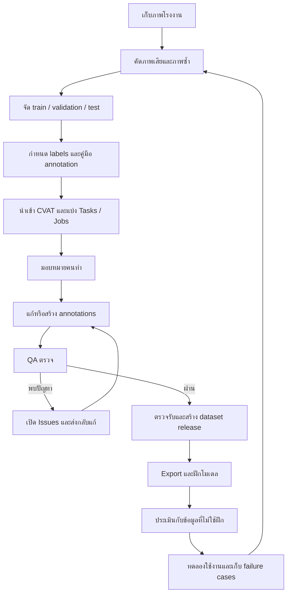
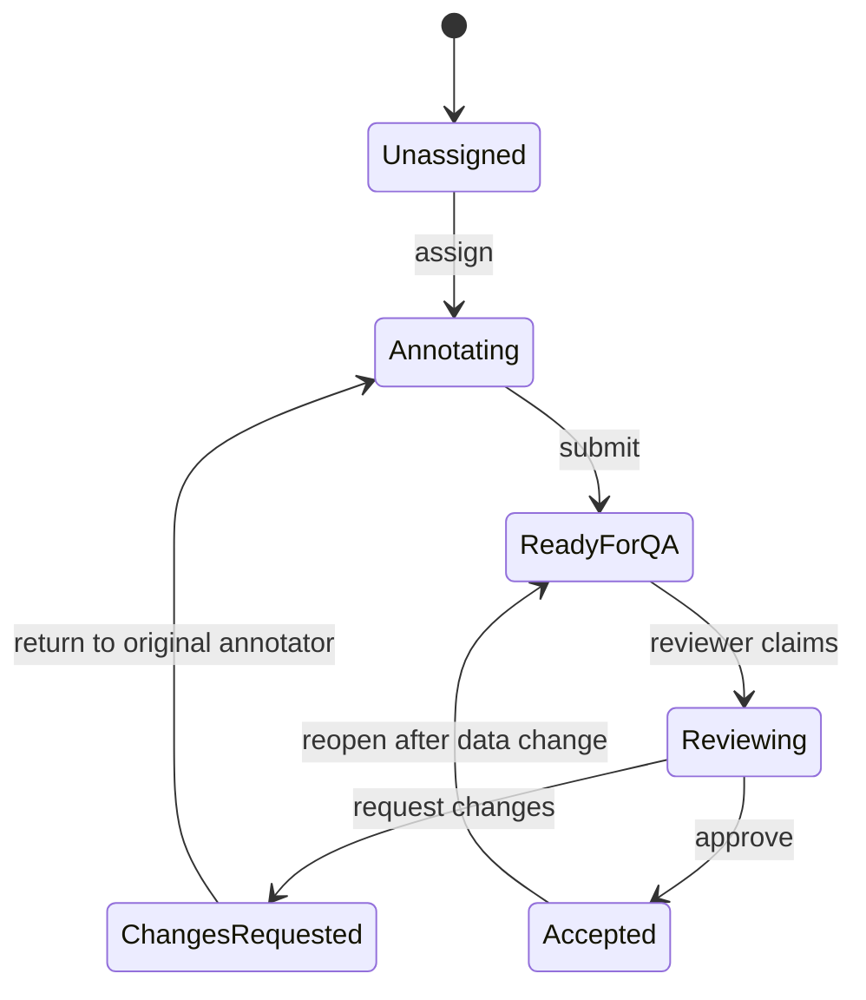

# คู่มือ Q&A: CVAT และแนวทางออกแบบระบบจัดการงาน Annotation / QA

วันที่จัดทำ: 16 กันยายน 2026
บริบท: CVAT ในเครื่อง `http://localhost:8080` รุ่นที่ API รายงานระหว่างตรวจสอบคือ `2.75.1`
กรณีศึกษา: dataset ตรวจจับอุปกรณ์โรงงาน 26 classes แบบ Ultralytics YOLO Detection

เอกสารนี้รวบรวมบทสนทนา ผลตรวจสอบจากเครื่องจริง และข้อเสนอสำหรับออกแบบระบบต่อยอด โดยเรียบเรียงใหม่และแก้คำแนะนำก่อนหน้าที่พบภายหลังว่ายังไม่ครบถ้วน ตัวอย่างชื่อคน จำนวนงาน และกำหนดส่งเป็นข้อมูลสมมติ เว้นแต่ระบุว่าเป็นผลตรวจสอบจริง

## สารบัญ

1. [ภาพรวมและศัพท์พื้นฐาน](#1-ภาพรวมและศัพท์พื้นฐาน)
2. [Q&A: การเข้าสู่ระบบ](#2-qa-การเข้าสู่ระบบ)
3. [Q&A: เตรียมและนำเข้า YOLO dataset](#3-qa-เตรียมและนำเข้า-yolo-dataset)
4. [เหตุขัดข้องจริงและวิธีแก้](#4-เหตุขัดข้องจริงและวิธีแก้)
5. [Q&A: ทำไมเห็นเพียงรูปเดียว](#5-qa-ทำไมเห็นเพียงรูปเดียว)
6. [Workflow สำหรับงานอุตสาหกรรม](#6-workflow-สำหรับงานอุตสาหกรรม)
7. [การ Review, Issue และ Comment](#7-การ-review-issue-และ-comment)
8. [หลายผู้ใช้งานและการจัดคิว](#8-หลายผู้ใช้งานและการจัดคิว)
9. [หน้าตาข้อมูลและรายงาน](#9-หน้าตาข้อมูลและรายงาน)
10. [Export และนำไปใช้งาน](#10-export-และนำไปใช้งาน)
11. [แนวทางออกแบบระบบต่อยอด](#11-แนวทางออกแบบระบบต่อยอด)
12. [แผนเริ่มใช้งานและเกณฑ์ทดสอบ](#12-แผนเริ่มใช้งานและเกณฑ์ทดสอบ)
13. [ไฟล์และแหล่งอ้างอิง](#13-ไฟล์และแหล่งอ้างอิง)

## 1. ภาพรวมและศัพท์พื้นฐาน

### Q: Project, Task และ Job ต่างกันอย่างไร?

โครงสร้างหลักคือ **Project → Task → Job → ภาพ/เฟรม**

| ระดับ | หน้าที่ | ตัวอย่าง |
|---|---|---|
| Project | รวม Tasks ที่ใช้ชุด labels ร่วมกัน | ตรวจจับอุปกรณ์โรงงาน 26 classes |
| Task | เก็บชุดข้อมูลและงาน annotation ชุดหนึ่ง | ภาพโรงงาน A พื้นที่ปั๊ม เดือนกันยายน |
| Job | หน่วยงานที่มอบหมายและติดตามสถานะได้ | ภาพช่วง 0–199 ให้คน A ทำ |
| ภาพ/เฟรม | ข้อมูลแต่ละภาพที่เปิดเพื่อตีกรอบ | ภาพที่มี pump 1 ตัวและ gauge 2 ตัว |
| Annotation | ข้อมูลกำกับวัตถุ | bounding box พร้อม class |
| Issue | จุดที่ต้องตรวจสอบหรือแก้ไขบนภาพ | กรอบกว้างเกินไปหรือวัตถุตกหล่น |
| Comment | ข้อความสนทนาใน Issue | คำแนะนำการแก้และคำตอบจากคนทำ |

ตัวอย่างการจัดงาน:

```text
Project: PTT Equipment Detection
├── Task: โรงงาน A / พื้นที่ปั๊ม — 1,000 ภาพ
│   ├── Job 1: ภาพ   0–199 → คน A
│   ├── Job 2: ภาพ 200–399 → คน B
│   ├── Job 3: ภาพ 400–599 → คน C
│   ├── Job 4: ภาพ 600–799 → คน D
│   └── Job 5: ภาพ 800–999 → คน E
└── Task: โรงงาน B / พื้นที่ท่อ — 1,000 ภาพ
    └── แบ่ง Jobs ตามขนาดงานและกำลังคน
```

จำนวนภาพต่อ Job เป็นตัวอย่าง การแบ่งจริงขึ้นกับ Segment size และตัวเลือกของ Task งานภาพแน่นหรือวัตถุซับซ้อนควรแบ่งให้ใช้เวลาทำและตรวจได้เหมาะสม ไม่ควรใช้จำนวนภาพอย่างเดียวประเมินภาระงาน

**Subset เช่น `train`, `val`, `test` เป็นการแบ่งข้อมูลเพื่อฝึกและประเมินโมเดล ไม่ใช่สถานะ QA ของคนทำงาน** โดยเฉพาะ `val` ของ dataset กับ Stage `Validation` ของ Job เป็นคนละเรื่อง

## 2. Q&A: การเข้าสู่ระบบ

### Q: ทำไมเข้า CVAT ไม่ได้?

ผลตรวจสอบ ณ ช่วงต้นของบทสนทนา:

- CVAT API `/api/server/about` ตอบ HTTP 200
- พบคำขอ login ตอบ HTTP 400
- ในฐานข้อมูลขณะนั้นมีบัญชี `admin2` ซึ่ง active และเคย login สำเร็จ

จึงแนะนำให้ตรวจชื่อผู้ใช้และรหัสผ่านก่อน อย่างไรก็ตาม **HTTP 400 เพียงอย่างเดียวไม่ยืนยันว่ารหัสผ่านผิด** ต้องดูข้อความตอบกลับของคำขอ login เพิ่มเติมจึงระบุสาเหตุได้แน่นอน

### แนวทางตรวจสอบ

1. ตรวจ URL ที่ใช้งานและการตอบสนองของหน้าเว็บ
2. ตรวจ containers และ backend API
3. ดู HTTP status และข้อความ error ของ login
4. ตรวจว่าบัญชี active และชื่อผู้ใช้ถูกต้อง
5. หากจำรหัสผ่านไม่ได้ ให้ใช้ขั้นตอน reset password ที่เหมาะสม โดยไม่ส่งรหัสผ่านลง log หรือเอกสาร

ตัวอย่างคำสั่งจาก directory ที่มี Compose configuration:

```bash
docker compose ps
docker compose logs --tail 100 cvat_server traefik
curl -i http://localhost:8080/api/server/about
```

การเข้าถึง Docker socket อาจต้องได้รับสิทธิ์ของเครื่อง ไม่ควรแก้สิทธิ์ socket ให้ทุกคนเข้าถึงเพื่อเลี่ยงปัญหา

## 3. Q&A: เตรียมและนำเข้า YOLO dataset

### Q: ต้องใช้ Create task หรือ Import dataset?

| สิ่งที่มี | วิธีที่เหมาะสม |
|---|---|
| ภาพหรือวิดีโอที่ยังไม่มี annotations | Create task แล้วเลือก source files |
| ภาพพร้อม YOLO annotations และ configuration | Project → Actions → Import dataset |
| มี Task พร้อมภาพอยู่แล้ว ต้องเพิ่ม annotations | ใช้การนำเข้า annotations ของ Task โดยตรวจชื่อภาพและรูปแบบให้ตรง |

การเลือก ZIP ภาพในหน้า Create task **ไม่ได้หมายความว่า YOLO labels ภายในจะถูกนำเข้าเป็น annotations อัตโนมัติ** สำหรับกรณีนี้ใช้ Project import จะตรงกับเป้าหมายกว่า

### Q: ไฟล์ dataset เดิมมีอะไรบ้าง?

Directory ที่ตรวจสอบจริง:

```text
/path/to/datasets/
└── equipment-detection-yolo/
    ├── data.yaml
    ├── train/
    │   ├── images/
    │   └── labels/
    ├── valid/
    │   ├── images/
    │   └── labels/
    └── test/
        ├── images/
        └── labels/
```

จำนวนที่ตรวจพบใน ZIP ชุดเต็ม:

| Subset directory | ภาพ | ไฟล์ labels `.txt` |
|---|---:|---:|
| train | 3,887 | 3,887 |
| valid | 773 | 773 |
| test | 551 | 551 |
| รวม | 5,211 | 5,211 |

ชุดเต็มมี 26 classes ได้แก่:

```text
actuator, analog-gauge, control-valve, control-valve-stem,
digital-gauge, flange, flow-fitting, flow-line,
handwheel-handle, handwheel-valve, lever-handle, lever-valve,
manual-valve-stem, meter, pig-alert, pig-closure, polished-rod,
positioner, pump, small-valve, spectacle-blind, stuffing-box,
valve-body, vertical-gauge, wellhead, xmas-tree
```

### Q: ใช้ train.zip, valid.zip, test.zip แยกกันได้ไหม?

ZIP แยกที่ตรวจในเครื่อง **ไม่มี `data.yaml`** จึงยังไม่ครบสำหรับวิธีนำเข้า YOLO dataset นี้ ต้องมี configuration ที่ระบุชื่อ classes และ path ของ subset ที่รวมอยู่ใน archive

ถ้าทำ archive เฉพาะ train ให้ configuration อ้างเฉพาะ train อย่าอ้าง val/test ที่ไม่ได้ใส่ไว้ใน ZIP

### Q: `labels.cache` จำเป็นไหม ต้องลบหรือไม่?

`labels.cache` เป็นข้อมูล cache ที่ YOLO ใช้ช่วยอ่าน dataset ไม่ใช่ annotations ต้นฉบับ CVAT ใช้ภาพและไฟล์ `labels/*.txt`

- ไม่จำเป็นต้องลบจากชุดต้นฉบับ
- ควรไม่นำ cache ใส่ ZIP สำหรับ CVAT เพื่อลดไฟล์ที่ไม่จำเป็น
- หากลบ cache โดยทั่วไป YOLO สามารถสร้างใหม่ได้
- ต้องเก็บภาพ, labels `.txt` และ configuration ไว้

### Q: ZIP ชุดเต็มใช้ได้เลยหรือไม่?

ไฟล์ที่ตรวจคือ:

```text
/path/to/datasets/
equipment-detection-yolo.zip
```

ตรวจพบขนาดประมาณ 2.38 GB มี configuration ภาพและ labels ไม่มี ZIP ซ้อน แต่ **การตรวจโครงสร้าง archive ยังไม่เท่ากับทดสอบนำเข้าสำเร็จ** ภายหลังพบว่า metadata บางรายการใน YAML ทำให้ตัวนำเข้าที่ติดตั้งอยู่ error

ดังนั้นคำตอบก่อนหน้าที่ว่าใช้ชุดเต็มได้ทันทีควรปรับเป็น: **โครงสร้างหลักครบ แต่ควรสร้างสำเนาที่ปรับ YAML ให้เข้ากับตัวนำเข้า และทดสอบก่อน import ชุดใหญ่** ในบทสนทนานี้แก้และทดสอบเฉพาะ ZIP ชุดเล็กแล้ว ไม่ได้แก้ ZIP ชุดเต็ม

### Q: สร้างชุดเล็กสำหรับทดสอบอย่างไร?

เลือก 20 ภาพพร้อม labels ที่ชื่อ stem ตรงกัน และทำ ZIP ดังนี้:

```text
cvat-test-20-fixed.zip
├── data.yaml
└── train/
    ├── images/
    │   ├── image001.jpg
    │   └── ...
    └── labels/
        ├── image001.txt
        └── ...
```

ชุดเล็กที่สร้างจริงเลือก 20 คู่แรกจากชื่อไฟล์ที่เรียงลำดับ มีไว้ทดสอบ pipeline **ไม่ใช่การสุ่มตัวอย่างที่รับรองว่าครบทั้ง 26 classes** แม้ configuration จะประกาศครบ 26 classes

ไฟล์ที่ควรใช้:

```text
/path/to/cvat/cvat-test-20-fixed.zip
```

ผลทดสอบกับ Datumaro ใน container ของ CVAT: อ่านได้ **20 ภาพ, 240 annotations, 26 classes ใน configuration**

ไฟล์แรก `cvat-test-20.zip` มี metadata ที่ทำให้ import ล้มเหลว ให้ใช้ไฟล์ `-fixed` แทน

## 4. เหตุขัดข้องจริงและวิธีแก้

### 4.1 “A task must contain at least one file”

ภาพหน้าจอแสดงหน้า Create task และช่องเลือกไฟล์ว่าง ข้อความนี้เป็นการตรวจข้อมูลของหน้าเว็บก่อนเริ่มสร้าง Task

ในช่วงที่ตรวจฐานข้อมูลพบ Projects แต่ยังไม่มี Task ที่บันทึกอยู่ จึงไม่ใช่กรณี worker ประมวลผลภาพช้า

หากเลือกไฟล์แล้วแต่ช่องยังว่าง ต้องตรวจการส่งไฟล์จาก file picker เข้าสู่ browser ด้วย ไม่ควรสรุปว่าผู้ใช้ไม่ได้เลือกไฟล์

### 4.2 “The file is required” ทั้งที่เลือกไฟล์แล้ว

พบ error ใน Ubuntu desktop portal ที่สัมพันธ์กับปัญหาโดยตรง:

```text
Failed to register file:///path/to/cvat/cvat-test-20.zip:
Timeout was reached
```

มี timeout ของภาพใน dataset หลายรายการด้วย ขณะเดียวกันยังไม่พบคำขอ import ของ Project #3 ใน backend logs ที่ตรวจ

เส้นทางปัญหาคือ:

```text
ผู้ใช้เลือกไฟล์
    ↓
Ubuntu file/document portal timeout
    ↓
Firefox ไม่ได้รับไฟล์สำเร็จ
    ↓
CVAT form ยังไม่มีไฟล์
    ↓
The file is required
```

วิธีที่ใช้แก้ในเครื่องนี้:

```bash
systemctl --user restart xdg-document-portal.service xdg-desktop-portal.service
systemctl --user is-active xdg-document-portal.service xdg-desktop-portal.service
```

ผลตรวจหลัง restart: ทั้งสองบริการ `active` จากนั้นปิด dialog, refresh CVAT และเลือกไฟล์ใหม่ การอัปโหลดครั้งต่อมาถึง backend แล้ว

คำสั่งตรวจ log ที่เกี่ยวข้อง:

```bash
journalctl --user --since '30 minutes ago' --no-pager \
  -u xdg-desktop-portal \
  -u xdg-document-portal
```

นี่เป็นวิธีแก้เหตุการณ์ที่พบหลักฐานแล้ว ไม่ใช่ขั้นตอนที่ต้องทำทุกครั้งที่ upload ไม่สำเร็จ การ restart portal อาจขัดจังหวะ dialog ของแอปอื่นที่กำลังใช้งานอยู่

### 4.3 Import error: `'int' object is not iterable`

หลัง file picker กลับมาทำงาน พบ import request เข้า worker แต่ล้มเหลว:

```text
CvatImportError: Failed to import dataset 'yolo_ultralytics_detection' ...
'int' object is not iterable
```

Traceback ชี้ไปที่ Datumaro YOLO parser ใน `_get_subset_image_paths` ซึ่งพยายามวนอ่านค่าจำนวนเต็มเป็นรายการแหล่งภาพ พฤติกรรมสัมพันธ์กับ `nc: 26` ใน YAML ที่นำเข้า

ไฟล์แก้ไขเก็บเฉพาะ `train` และ `names` สำหรับชุดทดสอบ โดยเอา `nc` และ metadata ของ Roboflow ออก ไม่ได้เปลี่ยนรูปหรือกรอบ annotations

ตัวอย่าง configuration แบบย่อสำหรับอธิบายโครงสร้าง:

```yaml
train: train/images
names:
  0: actuator
  1: analog-gauge
```

ตัวอย่างนี้แสดงเพียง 2 classes; ไฟล์ใช้งานจริงต้องมีครบตาม class IDs ใน labels และต้องรักษาลำดับเดิม ห้ามนำตัวอย่างย่อไปแทนไฟล์จริงที่มี 26 classes

**ข้อแก้ไขจากคำแนะนำก่อนหน้า:** เดิมแนะนำให้เก็บ `nc` ไว้ แต่สำหรับ parser ที่ติดตั้งในเครื่องนี้ การใช้ YAML ขั้นต่ำที่ไม่มี `nc` เป็น workaround ที่ทดสอบผ่านแล้ว ไม่ได้หมายความว่า `nc` เป็น field ที่ผิดสำหรับ Ultralytics โดยทั่วไป

ตัวอย่างตรวจ import logs:

```bash
docker compose logs --tail 200 cvat_worker_import
docker compose logs --tail 200 cvat_server traefik
```

### 4.4 ลำดับวินิจฉัยที่ควรใช้ในระบบ

| อาการ | ชั้นที่ควรตรวจ | หลักฐานที่ใช้ |
|---|---|---|
| เลือกแล้วไม่มีชื่อไฟล์ | Browser / OS file picker | Portal logs, browser errors |
| มีชื่อไฟล์แต่ส่งไม่สำเร็จ | HTTP / proxy / backend | Network status, server logs |
| Requests แสดง Failed | Import worker / dataset parser | Worker traceback |
| Import ผ่านแต่ข้อมูลผิด | Schema / class mapping / annotations | จำนวนภาพ, labels, visual inspection |

อย่าแก้ทุกปัญหาด้วยการ restart Docker เพราะปัญหาบางส่วนเกิดก่อน request ถึง CVAT

## 5. Q&A: ทำไมเห็นเพียงรูปเดียว?

หน้า Project แสดง thumbnail หนึ่งภาพต่อ Task ไม่ใช่ทุกภาพใน dataset

ในกรณีนี้หน้าจอแสดง Task `train` และข้อความ `1 annotating • 1 total` ซึ่งหมายถึงจำนวน Jobs ไม่ใช่จำนวนภาพ

```text
Project: ptt2 (#3)
└── Task: train (#2 ตามภาพหน้าจอหลัง import)
    └── Job: 1 งาน
        └── ภาพ 20 รูป
```

วิธีดู: กด Open ของ Task → เปิด Job → ใช้ปุ่มเปลี่ยนเฟรมหรือแถบเฟรม สำหรับชุด 20 ภาพต่อเนื่องนี้จะเป็นเฟรม 0–19

## 6. Workflow สำหรับงานอุตสาหกรรม

### Q: กระบวนการจริงควรเป็นอย่างไร?



สำหรับข้อมูลที่มี labels เดิมอยู่แล้ว ให้เริ่มจากการตรวจและแก้ labels ไม่จำเป็นต้องตีกรอบใหม่ทุกภาพ

### หลักการแบ่งข้อมูล

- จัด train/validation/test โดยระวังภาพใกล้เคียงจากวิดีโอเดียวกัน เครื่องจักรเดียวกัน หรือรอบถ่ายเดียวกัน
- ชุด validation ใช้ช่วยเลือกหรือปรับโมเดล ส่วน test ควรสงวนไว้สำหรับประเมินตามแผนที่กำหนด
- บันทึกแหล่งภาพและกลุ่มการเก็บข้อมูล เพื่อป้องกันการแบ่งข้อมูลที่ทำให้ผลประเมินสูงเกินจริง
- แยก dataset release แต่ละรอบ เพื่อย้อนกลับได้ว่าฝึกโมเดลด้วยข้อมูลรุ่นไหน

## 7. การ Review, Issue และ Comment

### Q: ตรวจและเขียน Comment บนภาพได้ไหม?

ได้ ใน source ของรุ่นที่ตรวจพบ Review workspace, เครื่องมือ Open an issue, comment thread และปุ่ม Resolve / Reopen

ขั้นตอนใช้งาน:

1. เปิด Task → Job
2. เลือก Review workspace
3. เลือก Open an issue และลากบริเวณที่มีปัญหา
4. เขียนรายละเอียดให้ชัดเจน
5. คนทำแก้ annotations, Save แล้วตอบใน Issue
6. QA ตรวจซ้ำและ Resolve หรือ Reopen ตามผลตรวจ

ตัวอย่าง:

```text
Issue #12 — Frame 7 — บริเวณเกจด้านขวา

QA: เกจนี้เป็นหน้าปัดเข็ม กรุณาเปลี่ยน digital-gauge เป็น analog-gauge
คนทำ: เปลี่ยน label และบันทึกแล้วครับ
QA: ตรวจแล้วถูกต้อง → Resolve
```

Comment ที่ดีระบุ **อะไรผิด + ต้องแก้อย่างไร + เหตุผลถ้าจำเป็น** เช่น “กรอบ pump กินพื้นที่ท่อด้านล่าง กรุณาปรับให้ชิดตัวปั๊ม” แทน “กรอบผิด”

### Q: Resolve แล้ว Job เสร็จเลยหรือไม่?

ไม่ควรตีความเช่นนั้น สถานะ Issue และสถานะ Job เป็นคนละส่วน Resolve คือปิดข้อผิดพลาดจุดหนึ่ง ส่วนการตรวจรับทั้ง Job ต้องตรวจตามกติกาของทีม

### ตัวอย่างกติกาของทีม

- คนทำตอบว่าแก้แล้วหลัง Save
- QA เป็นผู้ Resolve หลังตรวจซ้ำ
- หากยังมีประเด็นค้าง ห้ามถือว่าตรวจรับผ่าน
- หากไม่แน่ใจ class ให้ถามผู้เชี่ยวชาญและปรับคู่มือ แทนการเดา

กติกาข้างต้นเป็นข้อเสนอเชิงกระบวนการ **ไม่ได้รับรองว่า UI จะบังคับทุกข้อให้โดยอัตโนมัติ** หากต้องการบังคับ ต้องออกแบบ permission และ validation เพิ่ม

### ตัวอย่าง mapping สถานะ

| ขั้นตอนของทีม | Job Stage | Job State |
|---|---|---|
| กำลังทำ annotation | Annotation | In progress |
| QA กำลังตรวจ | Validation | In progress |
| ส่งกลับคนทำแก้ | Annotation | In progress |
| ตรวจรับเสร็จ | Acceptance | Completed |

นี่เป็น mapping ที่เสนอ ไม่ใช่ state machine อัตโนมัติที่ CVAT จะส่งงานต่อให้เอง ควรกำหนดความหมายของ Completed ในแต่ละ Stage ให้ชัด และไม่ใช้ Completed เพียงค่าเดียวสรุปว่า QA ผ่านเสมอ

## 8. หลายผู้ใช้งานและการจัดคิว

### Q: CVAT แจกงานให้คนว่างและส่งต่อ QA อัตโนมัติไหม?

ต้องแยกคิวระบบกับคิวงานของคน:

| ประเภท | พฤติกรรม |
|---|---|
| คิวประมวลผล import/export | Backend จัดให้ worker ประมวลผลและแสดงผลใน Requests |
| คิวงาน annotation / QA | ทีมกำหนดผู้รับผิดชอบและสถานะ หรือทำระบบต่อยอดผ่าน API |

ความสามารถแบ่ง Job ไม่เท่ากับการจัดตารางคน ความสำคัญ กำหนดส่ง และการส่งคืนเจ้าของเดิมโดยอัตโนมัติ

### วิธีเริ่มสำหรับทีมเล็ก

1. สร้างบัญชีส่วนตัวแยกกัน ไม่ใช้ `admin2` ร่วมกันทั้งทีม
2. ใช้ Organization และกำหนดสิทธิ์ตามหน้าที่ ตรวจพฤติกรรมสิทธิ์จริงด้วยบัญชีทดสอบ
3. แบ่ง Task เป็น Jobs ที่ทำเสร็จได้ในเวลาที่เหมาะสม
4. ผู้ประสานงานกำหนด Assignee
5. คนทำเสร็จแล้วแจ้งพร้อมตรวจ
6. ผู้ประสานงานเปลี่ยน Stage และมอบหมายผู้ตรวจ
7. เมื่อพบปัญหา ส่งกลับคนทำเดิมพร้อม Issues

Job มี Assignee ปัจจุบันหนึ่งคน หากเปลี่ยนเป็น QA ควรเก็บคนทำเดิมไว้ในระบบจัดคิว เพื่อไม่สูญเสียเส้นทางส่งกลับ

### เมื่อใดควรเพิ่มระบบอัตโนมัติ?

เมื่อกติกานิ่งแล้วและเริ่มมีภาระ เช่น แจกงานซ้ำ คิว QA ค้าง ลืมส่งกลับคนเดิม หรือทำรายงานด้วยมือมากเกินไป จึงเพิ่มระบบที่ทำสิ่งต่อไปนี้:

- แจกงานตามทักษะและจำนวนงานค้าง
- จัดลำดับตาม priority, due date และเวลารอ
- ส่งงานเสร็จเข้าคิว QA
- ส่งงานแก้คืน annotator เดิม
- แจ้งเตือนงานเลยกำหนดตามช่องทางที่ทีมอนุมัติ
- เก็บ assignment และสถานะย้อนหลัง

## 9. หน้าตาข้อมูลและรายงาน

### 9.1 Project summary

| Field | ตัวอย่าง | แหล่งข้อมูล |
|---|---|---|
| Project ID / name | 3 / PTT Equipment Detection | CVAT |
| Labels | 26 classes | CVAT |
| Annotation guideline | Equipment Guideline v1 | เอกสารทีม / ลิงก์ใน Project |
| ผู้ประสานงาน | Luke | ระบบจัดการทีม |
| Dataset release | ptt-equipment-v1 | ระบบ release ที่ออกแบบเพิ่ม |

### 9.2 ตารางคิว Job

| Job | จำนวนภาพ | คนทำเดิม | ผู้รับผิดชอบปัจจุบัน | ขั้นตอนทีม | Priority | Due date |
|---|---:|---|---|---|---|---|
| #101 | 100 | A | A | กำลังทำ | สูง | 18 ก.ย. |
| #102 | 100 | B | C | รอ QA | ปกติ | 18 ก.ย. |
| #103 | 100 | A | A | ส่งกลับแก้ | สูง | 19 ก.ย. |
| #104 | 100 | B | C | ตรวจรับเสร็จ | ปกติ | 19 ก.ย. |

ชื่อขั้นตอนเช่น “รอ QA” เป็น business status ที่ออกแบบเพิ่ม ไม่ใช่ชื่อ field ใน CVAT ทุกคำ

### 9.3 Issue report

รายงานที่สร้างโดยรวมข้อมูลจาก API อาจมีลักษณะนี้:

| Job | Frame | Issue | ปัญหา | สถานะ |
|---|---:|---|---|---|
| #103 | 7 | #12 | คลาสเกจผิด | Open |
| #103 | 9 | #13 | วาล์วตกหล่น | Resolved |

หากเพิ่ม category/severity เช่น `wrong_class`, `missing_object`, `critical` ให้ระบุว่าเป็น schema ของระบบต่อยอด ไม่ควรสมมติว่าเป็น field native ของ CVAT

### 9.4 Dashboard ที่ควรเริ่มทำ

```text
Project: PTT Equipment Detection
ภาพทั้งหมด                  1,000 ภาพ
Jobs ทั้งหมด                   10 งาน
ยังไม่เริ่ม                       2 งาน
กำลัง annotation                3 งาน
รอ/กำลัง QA                     2 งาน
ส่งกลับแก้                       1 งาน
ตรวจรับเสร็จ                     2 งาน
Issues ที่ยังเปิด                 14 จุด
งานเลยกำหนด                     1 งาน
```

ตัวเลขนี้เป็น mockup ไม่ใช่ผลจริงของ Project ปัจจุบัน และไม่ใช่ทุกช่องที่มีรายงานสำเร็จรูปใน CVAT

### 9.5 ตัวชี้วัดเริ่มต้น

- เวลาทำต่อภาพ: ระบุวิธีวัด active time หรือ elapsed time ให้ชัด
- First-pass acceptance rate: จำนวน Jobs ที่ QA ผ่านรอบแรก / จำนวน Jobs ที่ตรวจรอบแรกแล้ว
- QA backlog: จำนวนงานที่รอตรวจ และอายุงานที่รอ
- Rework rounds: จำนวนครั้งที่ส่งกลับแก้
- Open issues: แยกตาม Job หรือประเภทปัญหา

จำนวนกรอบและความยากของภาพมีผลต่อเวลา จึงไม่ควรเปรียบเทียบคนจากจำนวนภาพต่อชั่วโมงอย่างเดียว และ open issues เป็นศูนย์ไม่ได้ยืนยันว่าตรวจครบทุกภาพ

## 10. Export และนำไปใช้งาน

### Q: Export อะไรได้บ้างและใช้ต่างกันอย่างไร?

| เป้าหมาย | วิธี |
|---|---|
| ฝึกโมเดลด้วยภาพและ annotations | Export dataset เป็น YOLO/COCO พร้อม Save images |
| นำ annotations ที่แก้แล้วไปใช้กับภาพเดิม | Export โดยไม่รวมภาพ แล้วตรวจชื่อไฟล์และ class mapping |
| ทำรายงานคนทำ/QA/Issues | ดึง API มารวมเป็น CSV/JSON |

### ขั้นตอน Export สำหรับชุดนี้

1. Save annotations ที่ต้องการ
2. ตรวจขอบเขตงานและผล QA
3. Project → Actions → Export dataset
4. เลือก Ultralytics YOLO Detection 1.0
5. เปิด Save images เมื่อต้องการรวมภาพ
6. ยืนยันและติดตาม Requests
7. ดาวน์โหลดเมื่อประมวลผลเสร็จ

**อย่าสมมติว่า Project export กรองเฉพาะ Jobs ที่ QA ผ่านโดยอัตโนมัติ** หาก release ต้องมีเฉพาะข้อมูลที่อนุมัติ ต้องออกแบบการเลือกขอบเขตและตรวจ manifest เพิ่ม

### ตัวอย่างไฟล์ Export

```text
ptt2-export/
├── data.yaml
├── train.txt
├── images/
│   └── train/
│       ├── image001.jpg
│       └── image002.jpg
└── labels/
    └── train/
        ├── image001.txt
        └── image002.txt
```

ตัวอย่าง `train.txt`:

```text
images/train/image001.jpg
images/train/image002.jpg
```

ตัวอย่าง annotation หนึ่งวัตถุ:

```text
0 0.50 0.40 0.20 0.30
```

รูปแบบ: `class_id center_x center_y width height` ค่าพิกัดและขนาดเป็นสัดส่วนเทียบกับภาพ เช่น center_x 0.50 คือกึ่งกลางแนวนอนของภาพ

ต้องใช้ class mapping จาก `data.yaml` ของ export นั้น ไม่ควรสมมติว่า ID ตรงกับ dataset รุ่นก่อนเสมอ โดยเฉพาะเมื่อนำไฟล์ labels ที่แก้แล้วไปรวมกับชุดเก่า

### ตัวอย่างฝึก YOLO11

คำสั่งต่อไปนี้เป็นตัวอย่าง ยังไม่ได้รันฝึกโมเดลในบทสนทนา ต้องมี environment ที่ติดตั้ง Ultralytics, มี train/validation ที่แยกกัน และแก้ paths ใน YAML ให้ตรงกับเครื่องก่อน

```bash
yolo detect train \
  model=yolo11n.pt \
  data=/path/to/ptt2-export/data.yaml \
  epochs=50 \
  imgsz=640 \
  project=runs/ptt \
  name=equipment_v1
```

ตัวอย่างทำนายภาพใหม่ โดยปรับ path ไปยังโมเดลที่ได้จาก run จริง:

```bash
yolo detect predict \
  model=runs/ptt/equipment_v1/weights/best.pt \
  source=/path/to/new_factory_images \
  save=True
```

ชุดทดสอบ 20 ภาพมีเฉพาะ train เหมาะสำหรับทดสอบ import/review/export ยังไม่ใช่ชุดพร้อมประเมินโมเดลจริง ไม่ควรใช้ภาพเดียวกันทั้ง train และ validation เพื่ออ้างผล generalization

### Q: Comment และผล QA ติดไปกับ YOLO หรือไม่?

YOLO dataset export ไม่ได้เป็นรายงาน workflow ข้อมูล comments, assignment history และกำหนดส่งต้องเก็บหรือ export แยก

ตัวอย่าง CSV ที่ระบบรายงานสร้างเอง:

```csv
job_id,assignee,stage,state,open_issues
103,annotator_a,annotation,in progress,3
104,reviewer_c,acceptance,completed,0
```

CSV นี้เป็นข้อมูลที่รวมจากหลายส่วน ไม่ใช่คำรับรองว่ามีปุ่ม Export CSV รูปแบบนี้ใน CVAT

## 11. แนวทางออกแบบระบบต่อยอด

เนื้อหาส่วนนี้เป็นข้อเสนอสำหรับพัฒนา ไม่ใช่ระบบที่สร้างเสร็จแล้ว

### 11.1 แบ่งความรับผิดชอบของระบบ

```text
CVAT
  ภาพ / annotations / labels / Jobs / Issues / Comments
                  ↕ API
Workflow service
  คิว / priority / due date / คนทำเดิม / reviewer / ประวัติส่งงาน
                  ↕
Dashboard และรายงาน
  งานของฉัน / คิว QA / งานเลยกำหนด / throughput / rework
                  ↕
Dataset release + Training pipeline
  export manifest / class mapping / checksum / model run
```

หลักสำคัญคือกำหนดแหล่งข้อมูลหลักให้ชัด เช่น CVAT เป็นแหล่งหลักของ annotations และ comments ส่วน workflow service เป็นแหล่งหลักของ priority และ routing ไม่แก้ข้อมูลเดียวกันสองระบบโดยไม่มีกติกาซิงก์

### 11.2 บทบาทเชิงธุรกิจ

| บทบาท | หน้าที่ |
|---|---|
| Coordinator | ตั้งคิว แจกงาน เปลี่ยนผู้รับผิดชอบ ติดตามกำหนดส่ง |
| Annotator | สร้าง/แก้ annotation ตอบ Issues และส่งตรวจ |
| Reviewer | ตรวจ เปิด Issues และตัดสินผล QA |
| Domain expert | ตัดสินกรณี class หรือเกณฑ์อุตสาหกรรมไม่ชัด |
| Dataset manager | ตรวจขอบเขต release, export และ versioning |

บทบาทธุรกิจเหล่านี้ต้อง map เข้ากับสิทธิ์จริงของ CVAT/Organization และระบบเสริม ไม่จำเป็นต้องตรงกับชื่อ role native แบบหนึ่งต่อหนึ่ง

### 11.3 State machine ที่เสนอ



ชื่อเหล่านี้เป็น business states ของระบบใหม่ ควรเก็บ mapping กับ CVAT Stage/State แยก และบันทึก event ทุก transition

เงื่อนไขที่ควรออกแบบ:

- submit ต้องมั่นใจว่าการ Save annotations สำเร็จ
- approve ต้องมี reviewer ที่มีสิทธิ์ มีหลักฐานตรวจ และไม่มี blocking issues ตามนโยบาย
- การแก้ข้อมูลหลัง accepted ต้อง invalidate approval หรือเปิด review รอบใหม่
- การส่งกลับแก้ต้องรู้ annotator เดิม แม้ Assignee ปัจจุบันเป็น reviewer
- การเปลี่ยนสถานะจากหน้า CVAT โดยตรงต้องถูก reconcile กับ workflow service

### 11.4 ตัวอย่าง schema ของระบบจัดคิว

JSON ต่อไปนี้เป็น schema ที่เสนอ ไม่ใช่ response จาก CVAT API:

```json
{
  "work_item_id": "wi-103",
  "cvat_project_id": 3,
  "cvat_task_id": 2,
  "cvat_job_id": 103,
  "original_annotator_id": "user-a",
  "reviewer_id": "user-c",
  "current_owner_id": "user-a",
  "business_status": "changes_requested",
  "priority": 2,
  "due_at": "2026-09-19T10:00:00+07:00",
  "review_round": 1,
  "guideline_version": "equipment-v1",
  "version": 7
}
```

กำหนดความหมาย priority ให้ชัด เช่น เลขน้อยหมายถึงเร่งด่วนกว่า ใช้ `version` หรือกลไกเทียบเท่าเพื่อป้องกันการเขียนทับกันเมื่อหลายคนแก้พร้อมกัน

ตารางเสริมที่ควรมี:

| Entity | ข้อมูลหลัก |
|---|---|
| WorkItem | CVAT IDs, current owner, original annotator, business status |
| AssignmentHistory | from/to user, เวลา, เหตุผล, ผู้สั่ง |
| ReviewRound | reviewer, รอบตรวจ, ผลตรวจ, เวลาเริ่ม/จบ |
| WorkflowEvent | สถานะก่อน/หลัง, actor, timestamp, event ID |
| DatasetRelease | source scope, class mapping, checksum, approval snapshot |
| TrainingRun | release ID, model config, code revision, metrics, artifact path |

ไม่จำเป็นต้องทำสำเนา comment ทุกข้อความในฐานใหม่ ถ้าใช้ CVAT เป็นแหล่งหลัก ให้เก็บ reference และดึงสำหรับรายงานตามความเหมาะสม

### 11.5 กติกาคิวอัตโนมัติ

ตัวอย่างการเลือกงาน: กรองงานที่ผู้ใช้มีสิทธิ์และทักษะเหมาะสม → เรียง priority → due date → เวลารอนานที่สุด

ข้อที่ต้องรองรับ:

- Claim งานแบบ atomic เพื่อไม่แจก Job เดียวให้สองคนพร้อมกัน
- จำกัดงานที่ถือพร้อมกันตามบทบาท
- หาก reviewer ต้องเป็นคนละคนกับ annotator ให้บังคับเป็นกติกา
- งานแก้กลับเจ้าของเดิมก่อน หากไม่พร้อมให้ coordinator โอนพร้อมเหตุผล
- Retry API ต้องไม่สร้าง assignments หรือ transitions ซ้ำ ใช้ idempotency key/event ID
- แสดงสถานะ sync failed ให้ผู้ดูแลเห็น ไม่ทำให้หน้าจอเหมือนส่งงานสำเร็จทั้งที่ API ล้มเหลว
- ใช้ polling เป็นทางเลือกพื้นฐาน หากเลือก webhook ต้องตรวจชนิด event ที่รุ่นติดตั้งรองรับก่อน

### 11.6 หน้าจอที่ควรมี

1. **My work:** งานของฉัน, priority, due date, ปุ่มเปิด Job, จำนวน Issues
2. **QA queue:** งานรอตรวจ, annotator เดิม, รอบแก้, เวลารอ
3. **Coordinator board:** แจก/โอนงาน, ภาระงานรายคน, คิวค้าง, sync errors
4. **Dataset release:** ขอบเขตข้อมูล, จำนวนภาพ/annotations, approval snapshot, ดาวน์โหลด
5. **Audit history:** ใครส่ง ใครรับ ใครอนุมัติ และข้อมูลเปลี่ยนเมื่อไร

### 11.7 Dataset release ที่ตรวจสอบย้อนหลังได้

ก่อนส่งข้อมูลเข้า training ควรบันทึก:

- release ID และเวลาสร้าง
- project/task/job IDs ที่รวมอยู่
- class mapping และ guideline version
- จำนวนภาพและ annotations แยก subset
- hash/checksum ของ artifact
- วิธีแบ่ง train/validation/test และกลุ่มแหล่งภาพ
- snapshot การอนุมัติและ reviewer
- training runs ที่ใช้ release นี้

ระหว่าง export ต้องควบคุมหรือบันทึกการเปลี่ยน annotations เพื่อไม่ให้ approval อ้างข้อมูลคนละรุ่นกับไฟล์ที่ได้ วิธีอาจเป็นการ freeze งานช่วง release หรือสร้าง snapshot ตามกลไกที่ระบบเลือกใช้

## 12. แผนเริ่มใช้งานและเกณฑ์ทดสอบ

### ระยะ 1: ทดลองด้วย 20 ภาพ

- ใช้ `cvat-test-20-fixed.zip`
- แยกบัญชีคนทำกับ reviewer
- ทำคู่มือสั้นพร้อมตัวอย่าง class ที่สับสน
- เปิด Issue อย่างน้อยหนึ่งจุด ส่งกลับแก้ และ Resolve หลังตรวจซ้ำ
- Export พร้อมภาพและตรวจว่า annotation ที่แก้ติดออกมาจริง

### ระยะ 2: ใช้งานทีมเล็ก

- กำหนดขนาด Job จากเวลาที่วัดได้
- ใช้ตารางคิวเสริมเก็บคนทำเดิม, QA, priority และ due date
- เก็บ first-pass acceptance, เวลา QA รอ และจำนวนรอบแก้
- ตรวจว่าการแบ่ง train/validation/test ไม่รั่วไหลจากกลุ่มภาพใกล้เคียง

### ระยะ 3: เพิ่ม automation

- เริ่มจากอ่าน API ทำ dashboard ก่อน
- เพิ่ม assignment/routing เมื่อกติกาคงที่
- เพิ่ม dataset release และเชื่อม training pipeline
- ทดสอบสิทธิ์และ race conditions ก่อนเปิดหลายผู้ใช้จริง

### Acceptance tests สำหรับระบบต่อยอด

| กรณี | ผลที่คาดหวัง |
|---|---|
| สองคนกดรับ Job เดียวกัน | สำเร็จคนเดียว อีกคนเห็นว่างานถูกจองแล้ว |
| ส่งตรวจแล้ว API ขาดช่วง | retry ได้ ไม่ส่งงานซ้ำ และมีสถานะรอ sync |
| QA ส่งกลับ | กลับคนทำเดิมพร้อม Issues และเหตุผล |
| กด approve ทั้งที่มี blocking issues | ระบบปฏิเสธตามกติกาที่กำหนด |
| แก้ annotation หลัง approve | เปิด review ใหม่หรือทำให้ approval เดิมไม่ครอบคลุมข้อมูลใหม่ |
| Export release | ขอบเขตและจำนวนข้อมูลตรง manifest |
| Class IDs เปลี่ยน | ตรวจพบก่อนรวมกับ labels ชุดเก่าหรือเริ่ม training |
| เลือกไฟล์แล้ว portal timeout | แยกปัญหาฝั่งเครื่องออกจาก backend upload failure ได้ |

## 13. ไฟล์และแหล่งอ้างอิง

### ไฟล์ในเครื่อง

- ชุดทดลองที่แก้แล้ว: `/path/to/cvat/cvat-test-20-fixed.zip`
- ชุดทดลองเดิมที่ import ไม่ผ่าน: `/path/to/cvat/cvat-test-20.zip`
- Dataset ต้นฉบับ: `/path/to/datasets/equipment-detection-yolo/`
- ZIP ชุดเต็มที่ตรวจโครงสร้าง แต่ยังไม่ได้แก้และทดสอบ end-to-end: `/path/to/datasets/equipment-detection-yolo.zip`

### เอกสารและ source ใน repository ที่ใช้ตรวจสอบ

- [Ultralytics YOLO format](https://github.com/cvat-ai/cvat/blob/2dd476c64df8f27fd85b616b501e1f50adaa6500/site/content/en/docs/dataset_management/formats/format-yolo-ultralytics.md)
- [Import dataset dialog](https://github.com/cvat-ai/cvat/blob/2dd476c64df8f27fd85b616b501e1f50adaa6500/cvat-ui/src/components/import-dataset/import-dataset-modal.tsx)
- [Export dataset dialog](https://github.com/cvat-ai/cvat/blob/2dd476c64df8f27fd85b616b501e1f50adaa6500/cvat-ui/src/components/export-dataset/export-dataset-modal.tsx)
- [Issue dialog: Comments, Resolve, Reopen](https://github.com/cvat-ai/cvat/blob/2dd476c64df8f27fd85b616b501e1f50adaa6500/cvat-ui/src/components/annotation-page/review/issue-dialog.tsx)
- [Open an issue control](https://github.com/cvat-ai/cvat/blob/2dd476c64df8f27fd85b616b501e1f50adaa6500/cvat-ui/src/components/annotation-page/review-workspace/controls-side-bar/issue-control.tsx)
- [Job enums](https://github.com/cvat-ai/cvat/blob/2dd476c64df8f27fd85b616b501e1f50adaa6500/cvat-core/src/enums.ts)
- [YOLO import/export registrations](https://github.com/cvat-ai/cvat/blob/2dd476c64df8f27fd85b616b501e1f50adaa6500/cvat/apps/dataset_manager/formats/yolo.py)

### เอกสารภายนอก

- [Ultralytics YOLO11](https://docs.ultralytics.com/models/yolo11/)
- [Ultralytics CLI](https://docs.ultralytics.com/usage/cli/)
- [Ultralytics training](https://docs.ultralytics.com/modes/train/)

รายละเอียด UI, API และ parser อาจเปลี่ยนตามรุ่น หากอัปเกรด CVAT ให้ทดสอบชุดเล็กและ workflow เดิมซ้ำ โดยเฉพาะ YAML compatibility, permission, import/export และการซิงก์สถานะ
